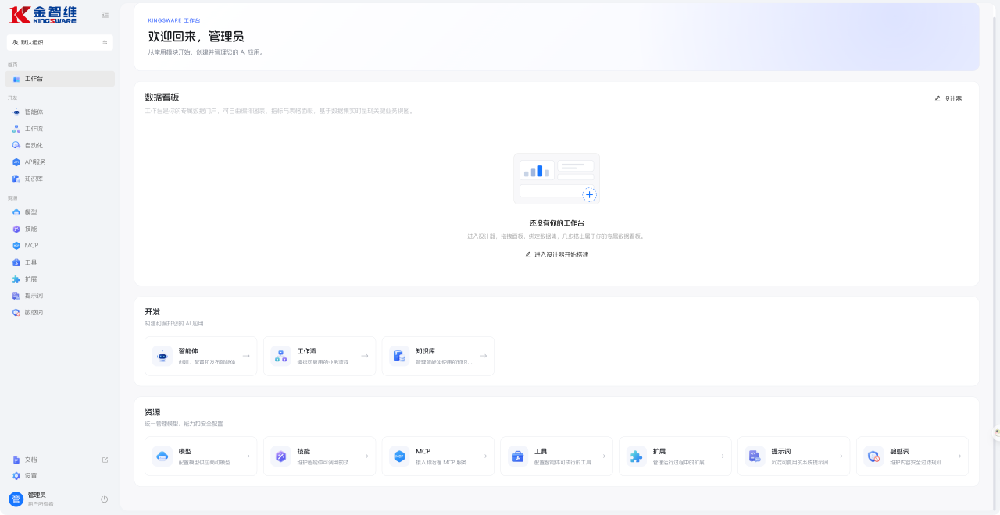
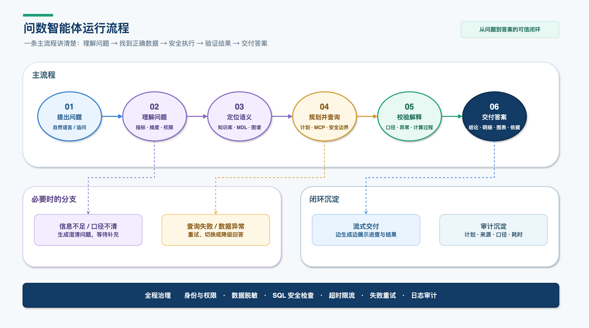
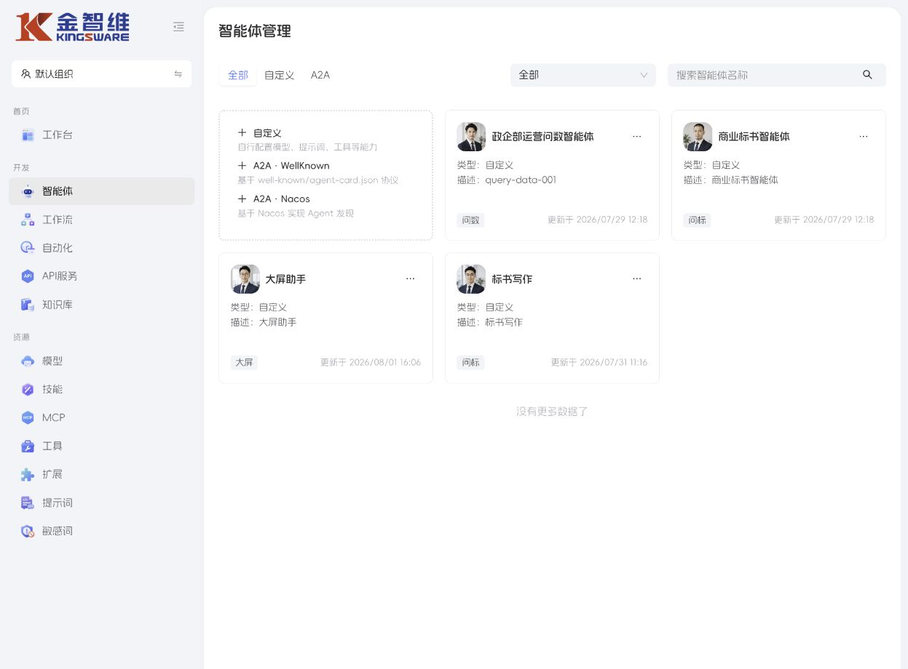
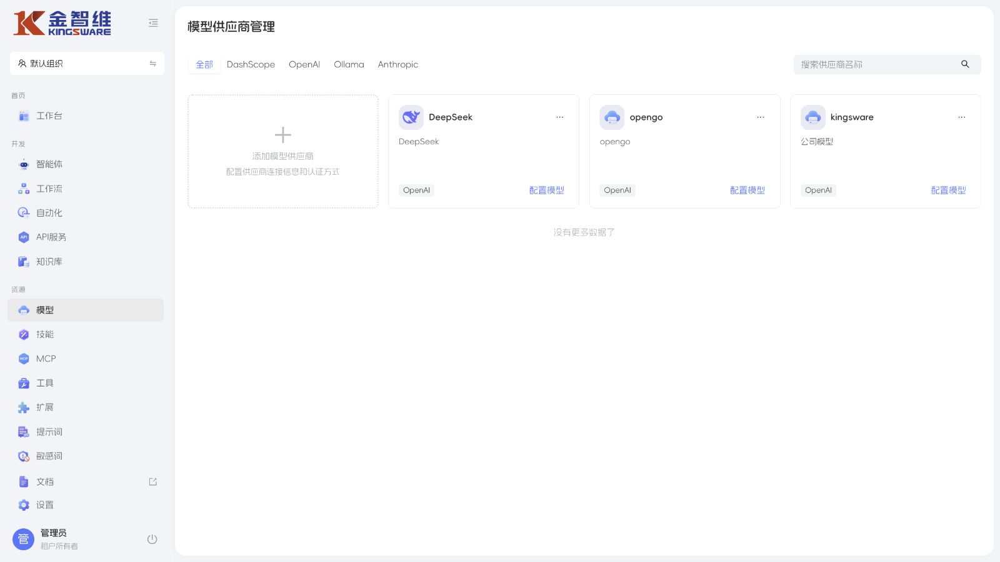
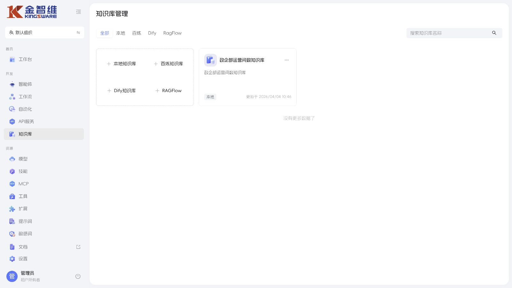
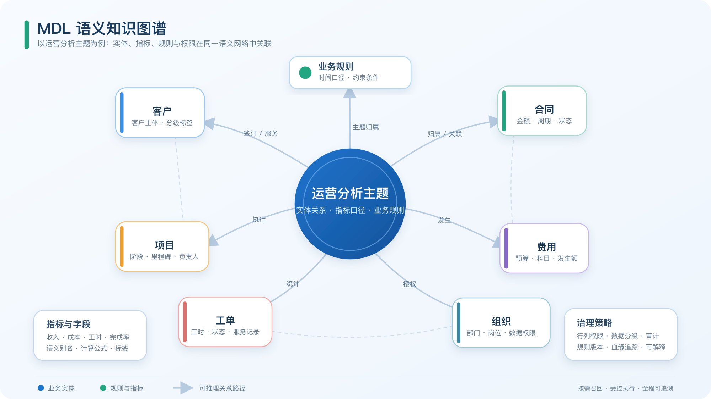
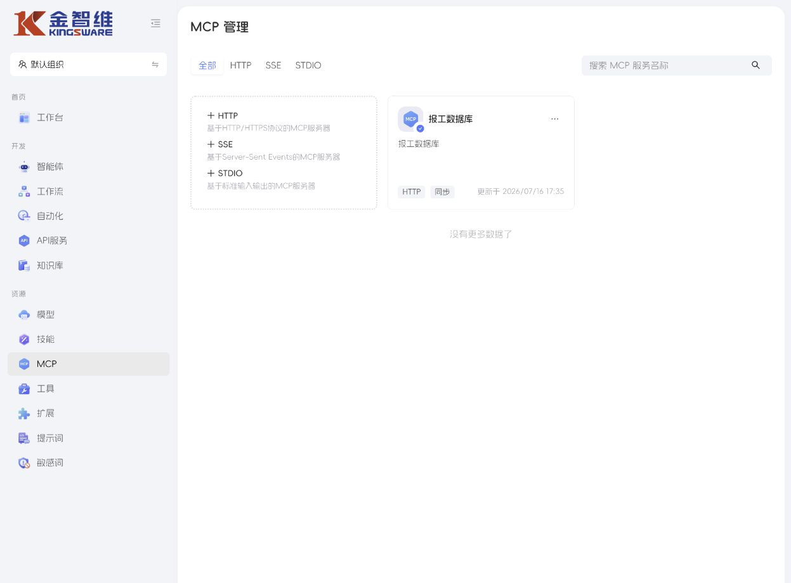
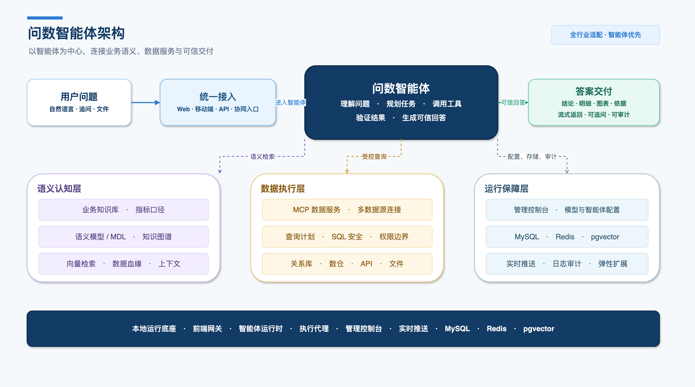

# 智能问数智能体

> 面向全行业的可信数据智能体平台
> 版本：V0.1（产品介绍初稿）｜2026-08

*真实产品界面：智能体开发、资源治理与运营入口。*

## 1. 智能体定义

智能问数智能体是一套以**业务智能体**为核心的企业级数据服务能力。它让管理者、业务人员和分析人员直接用自然语言提出问题，在统一的数据口径、权限边界和审计体系内，获得可解释、可追问、可落地的业务洞察。

它不是把聊天机器人接到数据库上，而是为每个业务场景装配一位“懂业务、懂数据、守规则”的智能体：能识别问题、拆解分析路径、定位相关数据资产、调用可信工具，并把结果转化为面向业务的结论与下一步建议。

## 2. 为什么需要智能问数智能体

企业的数据困境从来不是“没有数据”，而是数据难以被业务人员稳定地使用：

| 传统方式 | 真实痛点 | 智能问数智能体的改变 |
| --- | --- | --- |
| 找报表、找人取数 | 取数链路长，分析窗口稍纵即逝 | 用业务语言直接发问，智能体完成定位与调用 |
| 手工 SQL 与表格拼接 | 依赖少数数据专家，难以规模化 | 用场景语义与智能体策略沉淀可复用能力 |
| 指标口径各自理解 | 同一指标多种答案，决策缺少共同语言 | 标准口径、业务规则与数据模型统一约束 |
| 一次性查询 | 只给数字，无法解释原因或继续追问 | 支持连续追问、下钻、归因与结论沉淀 |
| 直接开放数据源 | 权限、误查、写入与审计风险高 | 模型白名单、受控只读、审计与健康治理 |

## 3. 产品定位：智能体优先，全行业适配

平台以“**一场景一智能体**”为组织方式。运营问数是首个成熟样板，但不是产品边界：只要一个场景具备可定义的业务对象、指标口径、数据关系、知识规则和权限范围，就可以快速配置对应的智能问数智能体。

### 行业与场景示例

| 行业 / 领域 | 可配置智能体 | 典型问题 |
| --- | --- | --- |
| 企业运营 | 经营运营问数智能体 | 本月经营目标完成情况如何？哪些项目存在交付风险？ |
| 销售与客户 | 销售增长智能体 | 本季度重点商机的转化瓶颈在哪里？ |
| 制造与供应链 | 生产供应智能体 | 哪些物料或工单可能影响本周交付？ |
| 金融与风控 | 风险核验智能体 | 哪类客户/业务的风险指标出现异常？ |
| 能源与园区 | 资产运营智能体 | 哪些设备能耗偏离基线，原因可能是什么？ |
| 公共服务 | 业务监管智能体 | 某区域事项的办理时效与积压情况如何？ |
| 项目型组织 | 项目交付智能体 | 资源投入、工时消耗与项目进度是否匹配？ |
| 财务与费用 | 费用分析智能体 | 费用增长主要来自哪些部门、项目或差旅类型？ |

## 4. 用户体验：从提问到行动的闭环

1. **自然语言提问**：用户用业务语言描述问题，也可从快捷问题、主题推荐与历史问法开始。
2. **理解与规划**：智能体识别业务对象、时间范围、分析目标、指标口径与需要补充的信息。
3. **可信数据求证**：智能体从受治理的数据资产中定位相关主题、关系路径和可用工具，执行受控查询。
4. **洞察式回答**：结果不仅有数字，还可以包含结论摘要、同比/环比、异常提示、原因线索、明细下钻和下一轮追问建议。
5. **沉淀与协同**：高价值问法、业务规则和确认后的分析路径可沉淀为组织知识，推动后续复用与运营闭环。

下图展示一次问数请求如何在业务语义、受控查询与结果验证之间形成可信闭环：

*问数智能体运行流程：从自然语言问题到可解释、可追问、可审计的业务答案。*

## 5. 五大产品能力

### 5.1 场景化问数体验

- 自然语言问数、连续追问与上下文记忆
- 快捷问题模板、主题推荐和面向角色的问数入口
- 结论、明细、口径说明、数据来源与追问建议的一体化呈现
- 面向经营、项目、销售、工时、费用、客户、资产等主题的场景化输出

### 5.2 智能体编排能力

平台支持按业务场景配置智能体的模型、系统提示词、工具、知识库、技能包、MCP 服务、子智能体和执行环境。

- **任务规划**：复杂问题可先形成多步分析计划，再逐步执行。
- **工具协同**：通过 MCP 统一接入外部数据、查询与业务能力。
- **知识增强**：结合知识库、业务规则和场景材料补全分析上下文。
- **记忆沉淀**：让连续对话保持业务上下文，并复用组织确认过的分析经验。
- **结构化输出**：可按场景输出结论卡片、表格、清单或可被下游系统消费的结构化结果。

*真实产品界面：按场景创建、配置和发布专属智能体。*

#### 模型配置与支持

平台统一管理模型供应商与模型配置，支持按供应商类型筛选、创建连接并将可用模型纳入智能体运行时配置。

*真实产品界面：模型供应商管理与模型配置入口。*

#### 知识资产接入与管理

平台支持本地与外部知识库接入，按知识源类型统一管理业务材料，为智能体提供可配置的知识增强能力。

*真实产品界面：知识库创建、接入与运营问数知识资产管理。*

### 5.3 图谱化海量数据认知

面对超大、超宽、跨主题且关系复杂的数据资产，平台不把全量库表、字段和规则一次性塞入模型上下文，而是采用“**图谱化理解、按需召回、受控执行**”的方式完成问数。

*图：以运营分析主题为例，将业务实体、指标口径、业务规则与权限策略组织为可推理的语义网络；问数时仅召回相关主题子图。*

| 能力 | 产品化说明 |
| --- | --- |
| MDL 语义模型图谱加载 | 解析模型、字段、指标、关系、业务规则和主题归属，形成可理解的语义资产地图。 |
| 分层与增量索引 | 按行业、业务域、主题、实体和指标建立分层索引；模型变化后可增量更新，不依赖全量重建。 |
| 主题子图召回 | 每次只加载与当前问题有关的模型、关系和口径，显著降低复杂库的上下文噪声。 |
| 关系路径发现 | 在客户、项目、合同、工单、费用、资产等复杂实体关系中，自动发现可用的分析连接路径。 |
| 历史问法复用 | 召回已确认的自然语言—查询样例，提升高频问题的稳定性和一致性。 |
| 查询计划约束 | 将问题理解、候选模型、业务规则与查询计划分层处理，避免“猜表、猜字段、猜口径”。 |

这套机制的价值在于：数据资产规模扩大时，智能体仍然能够**按域定位、按需理解、按权限查询**，而不是因模型数量和关系复杂度上升而失去可用性。

### 5.4 可信治理能力

可信不是回答“看起来合理”，而是让每一次问数都落在可定义、可控制、可追溯的边界内。

*真实产品界面：统一接入、管理与治理 HTTP、SSE、STDIO MCP 服务。*

- **统一口径**：业务规则与语义模型共同约束指标解释。
- **模型白名单**：只允许访问已发布、已治理的数据模型。
- **受控只读**：查询服务仅接受单条、无注释的 `SELECT` 或 `WITH` 查询；禁止写操作、多语句、原始底表和任意命令执行。
- **权限隔离**：可结合租户、角色、场景、数据模型与工具可用范围配置访问边界。
- **工具治理**：MCP 工具按全局可用状态管理，支持工具目录同步、JSON Schema 调试和历史记录。
- **全过程审计**：保留智能体配置、工具调用、问答日志与运行状态，便于追溯与运营分析。
- **健康与降级**：外部 MCP 连续发生传输类故障时可自动降级，避免不稳定服务持续参与运行；恢复后可重新连接并刷新工具目录。

### 5.5 管理与运营能力

- 智能体向导式创建、启停、标签、搜索与架构可视化
- MCP 服务接入、连接验证、工具刷新、工具启停与调试
- 知识库、提示词、技能包、模型与子智能体的统一配置
- 对话日志、使用统计、定时任务与运行状态管理
- 支持 HTTP、SSE 与 STDIO 三种 MCP 接入协议，以及同步/异步运行模式

## 6. 运营问数：对话样板

运营问数智能体面向企业经营、销售、项目、工时、费用与差旅等常见管理主题，帮助运营人员把“要一张报表”变为“直接问结论”。

可用的数据主题样例包括 CRM 销售、POC、售前记录、项目台账、报销、出差与工时记录；项目维度可以将多个业务事实主题组织起来，形成跨业务域的分析入口。

**典型问法**：

- 本月销售目标完成情况如何？重点商机卡在哪里？
- 哪些项目投入工时偏高但交付进度滞后？
- 哪些项目的差旅、报销与投入异常，需要优先关注？
- 本周新增 POC 和售前活动集中在哪些行业或区域？
- 某部门的费用增长主要由哪些项目和费用类型驱动？
- 

*真实产品界面：运营问数智能体的模型、提示词、MCP 与记忆等运行配置。*

## 7. 平台系统架构

平台采用“场景智能体—统一能力底座—可信数据资产”的分层架构：

*问数智能体总体架构：以智能体为中心，连接业务语义、数据服务与可信交付。*

总体架构强调三项核心能力：上层以统一入口承接业务问题，中间由问数智能体完成理解、规划、调用与验证，下层通过语义认知、数据执行与运行保障共同提供可扩展、可治理的问数能力。

| 层级 | 核心职责 | 代表能力 |
| --- | --- | --- |
| 场景智能体层 | 面向不同业务角色提供专属问数体验 | 运营、销售、项目、供应链、风控、资产等智能体 |
| 智能体编排层 | 理解问题、规划任务、调用能力、生成结果 | 模型、提示词、知识、记忆、计划、子智能体、结构化输出 |
| 数据认知层 | 在超大数据资产中定位业务语义与关系 | MDL 图谱、分层索引、主题子图、关系路径、规则与样例召回 |
| 工具与执行层 | 统一接入并调用数据与外部业务能力 | MCP、HTTP/SSE/STDIO、工具目录、Schema、调试与治理 |
| 治理与运维层 | 保证平台可控、可观测、可持续运营 | 权限、审计、健康检查、自动降级、日志、统计、定时任务 |
| 企业数据资产层 | 承载经治理的业务数据与语义模型 | 数据库、数据仓库、业务系统、知识库、行业规则 |

数据查询服务以语义模型为访问对象，并通过 Streamable HTTP MCP 暴露查询、模型目录、业务规则、历史问法召回与健康检查等标准能力。它是数据执行底座的一部分，不需要向业务用户暴露具体实现名称。

## 8. 部署与运行保障

平台支持从快速试用到生产多节点扩展的部署模式：前后端分离、一体化 JAR、Docker 单机体验与 Docker 多服务器生产部署。

| 组件 | 角色 | 参考运行方式 |
| --- | --- | --- |
| 管理控制台 | 智能体、模型、知识、MCP 与治理配置 | 服务端口 3060 |
| AI 运行时 | 承载智能体执行与对话运行 | 服务端口 3061 |
| 执行代理 | 承载受控执行能力 | 服务端口 3062 |
| 文件服务 | 多节点下的文件同步能力 | 按需部署 |
| MCP 数据服务 | 对外提供标准数据工具能力 | Streamable HTTP，默认路径 `/mcp`，参考端口 8765 |
| 数据与中间件 | 平台元数据、缓存、RAG 向量能力 | MySQL、Redis、PostgreSQL + pgvector 等 |

生产环境建议采用私有化或受控网络部署：MCP 数据服务只向受信任网络开放；应用入口通过反向代理统一管理；模型、数据源、身份与网络参数以环境配置方式注入，不在产品配置中明文保存敏感信息。

## 9. 场景适配方法论

新行业或新业务域的上线，不是重新开发一个问答机器人，而是为统一智能体底座装配三个“场景包”。

| 场景包 | 包含内容 | 交付结果 |
| --- | --- | --- |
| 场景语义包 | 数据模型、实体关系、指标口径、业务规则与常用分析路径 | 智能体知道“数据是什么、怎么关联、怎么解释” |
| 智能体策略包 | 角色定义、提示词、快捷问题、追问策略、输出模板与协同流程 | 智能体知道“如何像该领域专家一样工作” |
| 可信治理包 | 权限映射、可用模型、工具范围、审计要求、健康阈值 | 智能体知道“哪些事能做、哪些事不能做、如何留下证据” |

这种方法让行业适配成为可复制的配置与治理过程，而非一次性项目代码。
