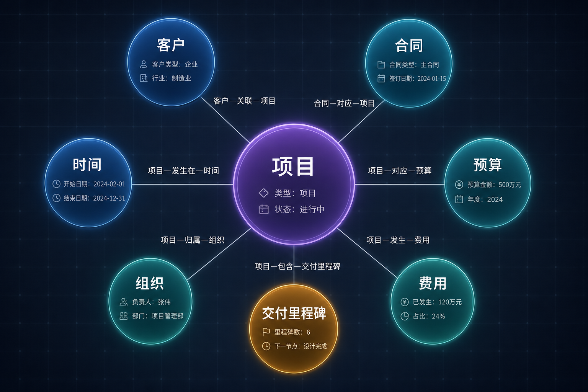
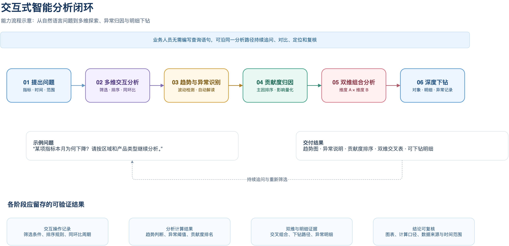
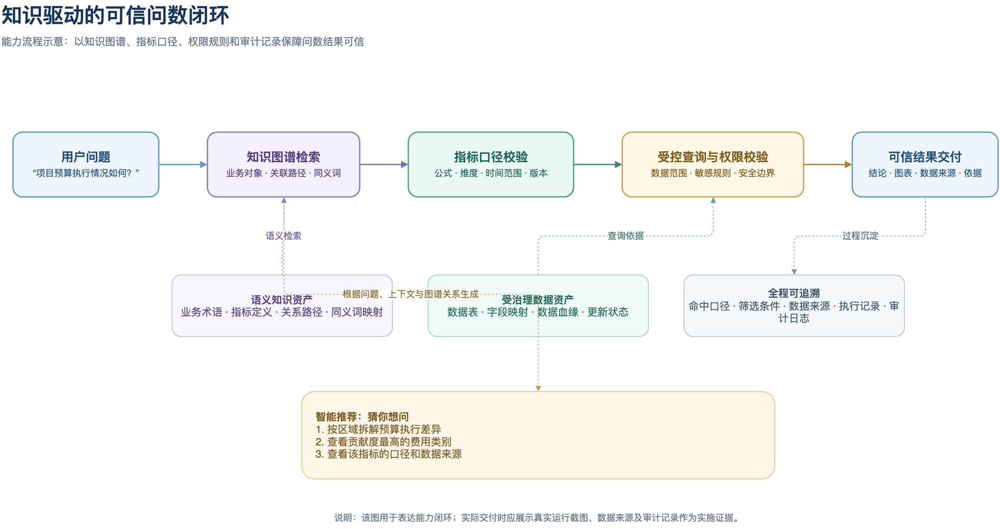
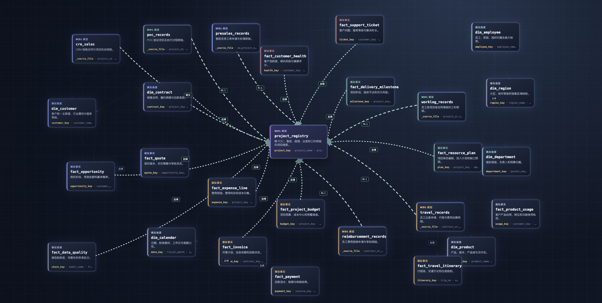
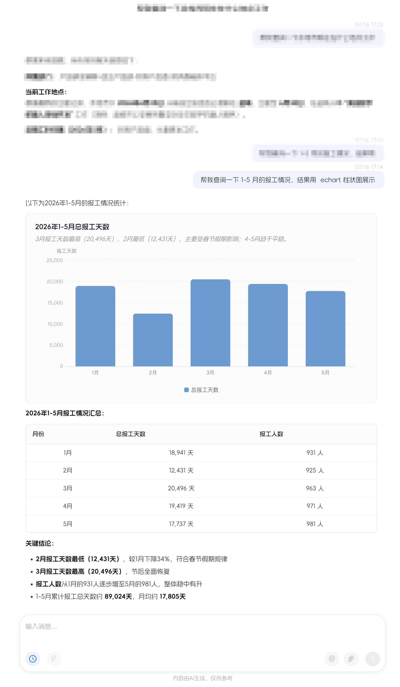
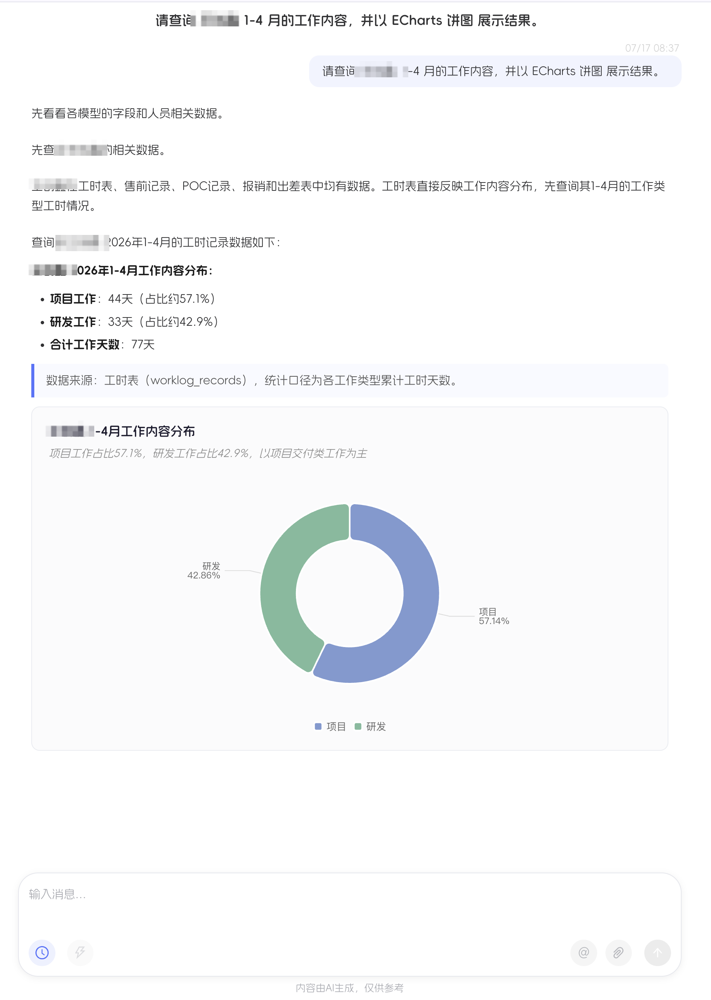

# 智能问数智能体

## 让每一位业务人员都能直接“问”数据、“读”数据、“用”数据

智能问数智能体面向经营、运营、项目、客户、合同等业务数据场景，以大语言模型、业务知识图谱和结构化数据分析能力为基础，为业务人员提供自然语言驱动的一站式数据服务。产品遵循“**先理解、再检索、后生成**”的可信问数路径：先理解问题中的业务实体与分析意图，再从统一指标口径、知识图谱和数据中心中检索事实，最后组织为可读、可追溯的业务结论。

用户无需掌握复杂的数据表结构或编写 SQL，只需使用日常业务语言提问，即可获得准确的数据查询结果、指标解读、趋势判断和异常归因，并可围绕结果持续追问和逐层下钻。

> **产品定位**：面向业务运营与管理的智能数据分析助手，让数据服务从“找报表、等取数”升级为“随问随答、主动洞察”。

> **核心理念**：大模型负责理解、编排与解释；业务知识、指标口径和数据事实由受治理的数据资产提供。让智能体“会说业务语言”，更要“依据业务事实说话”。


---

## 一、业务痛点

业务数据通常分散在经营、运营、项目、客户、合同等不同主题中，传统数据使用方式通常面临以下问题：

- **取数门槛高**：业务人员需要了解报表位置、数据表关系和指标计算逻辑，简单问题往往依赖数据人员支持。
- **指标口径不统一**：同一指标存在不同名称、不同统计范围或不同计算方式，影响协同效率和管理判断。
- **分析过程长**：从发现指标波动到定位影响维度，再到查看明细，通常需要多轮取数和人工分析。
- **结果停留在“看数”**：传统报表能够展示数据，却难以主动解释趋势、异常及其主要驱动因素。

智能问数智能体将业务语义、指标口径与数据分析能力统一连接，帮助用户快速完成“提出问题—获取数据—理解原因—形成行动”的分析闭环。

---

## 二、核心能力

### 1. 自然语言智能问数

用户可以直接用自然语言查询业务数据，例如：

> “今年各省物资采购金额同比情况如何？”
> “广东省 110kV 物资库存为什么下降？”
> “近三个月哪些仓库的库存周转异常？”

智能体通过实体识别与条件解析，自动识别问题中的核心指标、业务实体、统计周期、分析维度和筛选条件，并转换为可执行的受控数据查询任务；同时支持上下文理解和多轮连续对话。

### 2. 统一术语层与指标管理

围绕业务数据建立统一的语义知识库，集中管理指标定义、计算公式、统计口径、维度层级、业务术语、同义词和别名映射。

系统将“采购金额”“库存数量”“库存周转天数”等业务语言与底层数据资产建立关联，在业务人员与数据系统之间形成统一的语义桥梁，保障结果准确性和口径一致性。

### 3. 交互式多维分析

查询结果支持进一步的下钻、上卷、筛选、排序、多组对比、同比和环比计算。用户可从全网总体指标逐层定位到省区、地市、仓库、物资类型、供应商或业务明细，无需重新编写复杂查询。

### 4. 自动趋势、异常与归因解读

系统不止返回数值，还能基于查询结果生成业务解读：

- 识别连续增长、连续下降、阶段性波动等趋势；
- 发现超阈值变化、异常波动和重点风险项；
- 自动呈现同比、环比、结构占比及变化情况；
- 以业务语言说明“发生了什么、影响范围如何、建议关注什么”。

### 5. 指标贡献度分析

当核心指标出现异动时，智能体可自动扫描省区、地市、仓库、物资类型等业务维度，量化各维度对总体变化的贡献度，并按影响程度排序。

例如，对于“某类物资金额下降原因”的问题，系统能够定位主要影响省区、重点仓库或具体物资类别，清晰说明哪些因素构成正向拉动、哪些因素造成负向拖累。

### 6. 双维度组合与深度下钻

支持“省份 × 物资类型”“仓库 × 供应商”等双维度交叉分析。系统对组合后的数据进行分组聚合、变化计算和贡献度排序，帮助用户从总体异动进一步定位到具体业务组合。

对于高贡献度对象，还可依据预设分析主题和异常规则，自动下钻至库存、采购、合同等明细数据，识别疑似异常物资或关键业务记录。

### 7. 知识图谱与智能推荐

知识图谱将分散的业务对象、指标、数据资产和分析规则组织为可计算的语义网络。以项目、客户、合同、产品、组织、区域、时间等业务对象为节点，以“归属”“关联”“统计”“执行”“影响”等业务关系为边，并将指标口径、数据表、字段、数据血缘和权限范围纳入统一管理。

当用户提出问题时，智能体可沿图谱完成业务对象定位、指标语义消歧、关联数据资产发现与查询范围校验。例如，面对“项目预算执行情况如何”的问题，系统可关联项目、预算、费用、合同、组织和时间等节点，明确所需指标、数据来源及可下钻维度，再生成受控查询计划。

**图谱构建与维护能力**：

- 支持配置实体类型、属性、关系类型及其业务规则，持续沉淀业务语义资产；
- 支持关联指标、数据表、字段、接口与文档，构建从业务语言到数据资产的映射；
- 支持展示实体详情、关联路径、影响范围及数据血缘，帮助业务人员理解数据来源和计算依据；
- 支持同义词、别名、层级关系和口径版本管理，减少同名异义、异名同义带来的理解偏差。



**智能推荐与主动引导**：

系统根据当前问题、命中指标、已选维度、查询结果和对话上下文，识别用户当前所处的分析阶段，并推荐 2—3 个下一步可执行的问题：

| 分析阶段 | 推荐方向 | 推荐问题示例 |
| --- | --- | --- |
| 现状查看 | 补充时间、范围或对比口径 | “按月查看近六个月趋势” |
| 趋势发现 | 定位异常发生的区域或对象 | “哪些区域的变化最明显？” |
| 原因探究 | 计算贡献度并交叉分析 | “按产品类型拆解主要影响因素” |
| 问题定位 | 继续下钻至业务明细 | “查看贡献度最高对象的明细记录” |
| 结论形成 | 复核口径、来源与影响范围 | “该指标的计算口径和数据来源是什么？” |

推荐结果不是开放式猜测，而是基于图谱关联、可用指标、用户权限和当前分析路径生成。这样既能减少用户组织问题的成本，又能将数据探索自然引导到“现状—趋势—归因—明细—结论”的分析闭环。

### 8. 可信问数与过程可追溯

系统将业务问数过程拆解为可校验的步骤：实体与条件识别、意图路由、指标口径校验、数据检索、分析计算与结论生成。每一步均可保留相应的业务依据，支持展示命中的指标定义、筛选条件、数据范围、计算结果和分析路径。

当系统无法识别指标口径、缺少必要筛选条件或查询结果为空时，将明确提示用户补充问题或调整条件，而不是基于不完整信息生成结论。这一机制让结果既便于业务人员阅读，也可供数据人员核验。

平台工作台统一提供智能体、工作流、知识库、模型、技能、MCP 服务及安全能力的配置入口，使问数能力具备可配置、可管理、可持续运营的基础。


---

## 三、交互式智能分析闭环

```text
用户自然语言提问
        ↓
实体与条件识别（指标、维度、时间、筛选条件）
        ↓
意图识别与任务路由（查询、对比、趋势、归因、下钻）
        ↓
术语层、指标库与知识图谱校验
        ↓
受控查询：结构化数据检索与指标计算
        ↓
分析推理：趋势、异常、贡献度与归因分析
        ↓
受控生成：基于事实生成结论，支持追问与下钻
```

该流程借鉴知识图谱 RAG 的受控检索思路：以实体识别定位业务对象，以意图路由确定分析任务，以知识图谱和指标库校验语义，再调用受控的数据查询与计算能力，最后仅依据查询结果和分析结果生成结论。这样既保留自然语言交互的易用性，也增强数据结论的可靠性与可追溯性。


运行过程遵循“理解问题—定位语义—规划并查询—校验解释—交付答案”的主线。对于信息不足、口径不清或数据异常等情况，系统生成澄清问题、执行重试或切换降级回答；对于已完成的问数任务，则沉淀执行计划、数据来源、口径、耗时和审计记录，形成从问题到答案的可追溯闭环。



---

## 四、系统架构与可信问数

产品以知识图谱、指标口径、受治理数据资产和审计规则构成可信问数闭环：


系统采用以问数智能体为核心的分层架构：

- **统一接入与交付层**：通过 Web、移动端、API 或协同入口接收自然语言问题，并以结论、明细、图表和依据进行流式交付。
- **智能体编排层**：负责理解问题、规划任务、调用工具、验证结果，并组织最终可信回答。
- **语义认知层**：以业务知识库、指标口径、语义模型、知识图谱、向量检索和上下文为基础，完成语义定位与查询约束。
- **数据执行层**：通过 MCP 数据服务连接关系库、数仓、API 和文件，完成查询计划、安全校验、权限控制与数据计算。
- **运行保障层**：提供模型与智能体配置、实时推送、日志审计、缓存与存储能力，保障系统稳定运行和持续运营。

| 架构层 | 核心职责 |
| --- | --- |
| 交互展示层 | 提供问答、数据卡片、表格、图表、分析摘要、图谱可视化与多轮会话能力。 |
| 语义理解层 | 识别用户问题中的指标、维度、实体、时间和筛选条件，完成意图识别与任务路由。 |
| 知识与指标层 | 管理业务术语、指标口径、业务规则、同义词、维度关系与知识图谱。 |
| 数据分析层 | 对接数据中心同步的结构化数据，执行查询、聚合、同环比、贡献度和归因计算。 |
| 治理与运营层 | 提供权限控制、日志审计、问题反馈、知识维护和模型效果持续优化能力。 |

参考知识图谱 RAG 架构，智能体将大模型定位为“理解、编排和解释”的能力中枢，而将业务事实、指标口径和计算结果沉淀在受治理的数据与知识体系中，实现更可信的企业级问数服务。



业务语义模型将项目、客户、合同、报价、交付、资源、预算等业务对象，与事实表、维度表和数据血缘关系统一组织。它为智能体理解用户所说的“指标、对象、范围和关联关系”提供可检索、可验证的语义依据，是自然语言问数准确落到数据查询与分析任务的基础。



---

## 五、与传统问数方式的差异

| 对比维度 | 传统报表 / 自助取数 | 智能问数智能体 |
| --- | --- | --- |
| 使用入口 | 查找报表、配置筛选项或编写查询 | 使用自然语言直接提问 |
| 业务理解 | 依赖用户理解指标、表结构和字段含义 | 自动识别指标、维度、时间与筛选条件 |
| 结果呈现 | 以数值、表格和固定图表为主 | 数据结果 + 趋势解读 + 异常提示 + 归因结论 |
| 分析路径 | 用户手动切换报表、逐层筛选 | 支持连续追问、下钻和双维度组合分析 |
| 可信保障 | 依赖人工辨别统计口径 | 基于指标库、知识图谱、查询结果与分析路径进行校验和追溯 |

---

## 六、典型应用场景

| 场景 | 用户问题示例 | 智能体价值 |
| --- | --- | --- |
| 采购执行监控 | “本月各省采购金额完成情况如何？” | 快速汇总进度、同比环比与异常区域。 |
| 库存运营分析 | “哪些仓库库存周转天数异常？” | 定位异常仓库和物资类别，支持下钻明细。 |
| 物资消耗分析 | “某类物资消耗下降的主要原因是什么？” | 计算区域、仓库、物资等维度的贡献度。 |
| 合同与供应商分析 | “重点供应商履约情况有哪些风险？” | 联动合同、交付与采购数据，形成风险提示。 |
| 管理驾驶舱辅助决策 | “全网库存金额波动由哪些因素造成？” | 自动拆解核心指标，提供量化归因与结论摘要。 |

以下为智能体以自然语言接收问题、生成图表与汇总结论的交付示例。展示图片中的业务信息已完成脱敏处理。




