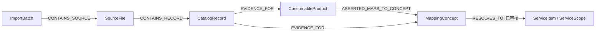

# 河南医保目录 Neo4j Cypher 生成指导（EDA 修订版）

> 适用范围：六份河南医保目录 XLSX 的 Neo4j 5.x 图谱与 Cypher 生成。  
> 依据：原始目录分析及 [河南医疗目录与耗材映射库探索性分析报告](/Users/rocket/wren-query-data/analysis/河南医疗目录_xlsx_neo4j_eda_report.md)。  
> 定位：本文件是独立、保守的 V2 指导。它以“可追溯且不夸大语义”为优先级，不直接连接未获得权威字典确认的耗材映射代码和当前服务项目。

## 1. V2 的核心决策

V2 相比早期模型有一个根本变化：源表“映射结果”中的代码首先是**映射概念**，不是已确认的河南服务项目。



这样可以同时表达三种事实：

1. 某耗材行原文声明了代码 `0133b`。
2. `0133b` 在当前来源中带有某个观察到的名称。
3. 只有在获得权威字典后，`0133b` 才可被解析到具体服务项目或服务范围。

### 1.1 禁止的语义跳跃

以下两种断言在当前六份 XLSX 的证据范围内不成立：

```text
“token 可拆出字母数字代码” = “已解析为业务实体”
“代码形态像项目编码” = “等同于当前 ServiceItem”
```

EDA 已验证：665,401 个映射 token 都可从文本中拆出字母数字前缀，但跨来源共有 601 个目标代码，与 17,503 个服务目录代码别名仅有 `B250903002` 一个精确重合。大小写归一化后结论不变。

因此，`PROJECT_LIKE`、`SCOPE_LIKE` 和 `UNKNOWN` 只能作为 `MappingConcept.classification_status`，不得据此生成 `ASSERTED_MAPS_TO_SERVICE`。

## 2. 数据事实与质量基线

### 2.1 工作表与真实行数

| 来源/工作表 | 有效行数 | 图谱定位 |
|---|---:|---|
| 耗材映射库 | 157,738 | 耗材主数据和原始映射证据 |
| 耗材变更 | 4,944 | 主耗材的变更证据，不是独立耗材主数据 |
| 服务项目映射库 | 7,130 | 服务项目、分类行、版本属性 |
| 服务项目新增 | 61 | 主服务目录的新增证据 |
| 服务项目停用 | 64 | 主服务目录的停用证据 |
| 基本物耗映射库 | 11,452 | 主耗材子集及基本物耗映射 |
| 谈判子库 | 94 | 27 位谈判 SKU |
| 药品目录模板 | 17,973 | 药品产品目录 |
| 诊疗目录模板 | 110 | 独立诊疗命名空间的专题/增量目录 |
| 诊疗 Sheet1 | 4 | 无表头的补充记录和 82 条映射证据 |

禁止使用 Excel `max_row` 作为导入记录数。诊疗目录声明到第 917,125 行、耗材变更表声明到第 1,048,576 行，但实际业务行远少于该值。

### 2.2 覆盖与映射基线

| 指标 | 基线 |
|---|---:|
| 原始源行 | 199,570 |
| 20 位耗材基础代码 | 105,594 |
| 耗材主表行 | 157,738 |
| 主码重复行 | 52,144 |
| `(主码, 注册号, 规格, 型号)` 仍重复的行 | 2,159 |
| 基本物耗代码命中主库 | 7,868 / 7,868 |
| 变更代码命中主库 | 2,954 / 2,954 |
| 谈判 SKU 前 20 位命中主码 | 94 / 94 |
| 跨来源原始映射 token | 665,401 |
| 跨来源不同映射概念代码 | 601 |
| 映射概念与服务代码别名精确重合 | 1 / 601 |

### 2.3 价格与日期风险

所有金额写入图谱时均保留三份信息：`raw_value`、`normalized_decimal` 和 `value_semantics`。

| 风险 | 处理要求 |
|---|---|
| 耗材最高限额 `20000` 出现 101,918 次 | `value_semantics='UNCONFIRMED_SENTINEL'`，不解释为真实价格 |
| 药品最高价格 `40000` 出现 9,395 次 | 同上 |
| 其他高频值如 `110000` | 等待业务定义后才赋予业务语义 |
| 药品终止时间 `46142` | 预处理为 `2026-04-30`，同时保留原值 |
| 空终止日期 | 视为开放区间，不视为质量错误 |

## 3. 图谱分层与证据等级

### 3.1 四层数据模型

| 层 | 节点/关系 | 规则 |
|---|---|---|
| Raw | `ImportBatch`、`SourceFile`、`CatalogRecord` | 原始值不可覆盖，保留文件、工作表、Excel 行号、行哈希和原始 JSON |
| Staging | 规范化 CSV、拆分 token、路径键、日期与 Decimal | 不直接入图，所有字段可重建 |
| Curated identity | 服务、耗材、药品、机构、分类、映射概念 | 只按稳定身份键 `MERGE` |
| Curated assertion | 映射、版本、政策、价格、解析关系 | 每条关系有来源、审核状态和有效期 |

### 3.2 关系证据等级

| 证据等级 | 关系类型示例 | 能否当作事实 |
|---|---|---|
| `RAW_ASSERTED` | `ASSERTED_MAPS_TO_CONCEPT` | 是，事实是“源文件声明了该代码” |
| `NORMALIZED` | `PRODUCT_OF`、`SKU_OF`、`PARENT_OF` | 是，基于确定性键和路径 |
| `RESOLVED` | `RESOLVES_TO` | 仅当 `authority` 明确且 `review_status='ACCEPTED'` |
| `DERIVED` | `DERIVED_IN_SCOPE` | 有完整规则、置信度和审核状态时可用 |
| `SUGGESTED` | `SUGGESTED_SAME_AS` | 否，只用于人工复核 |

每条 Raw、Resolved、Derived 或 Suggested 关系必须带：

```text
assertion_id, batch_id, source_id, source_file, source_sheet, source_row,
source_column, raw_value, derivation_rule, authority, confidence,
review_status, valid_from, valid_to
```

## 4. 节点、键和命名空间

### 4.1 核心节点

| 标签 | 唯一键 | 作用 |
|---|---|---|
| `ImportBatch` | `batch_id` | 一次实际导入运行、输入清单、校验和、程序版本 |
| `SourceFile` | `source_id` | 文件和工作表组成的来源分区 |
| `CatalogRecord` | `record_id` | 不可变的原始证据行 |
| `CatalogRecordVersion` | `version_id` | 某稳定实体在一个目录版本中的业务快照 |
| `MappingConcept` | `(namespace, code)` | 历史/结算/映射命名空间中的目标代码 |
| `ObservedLabel` | `(namespace, code, label)` | 同一映射代码的多个原始显示名称 |
| `ServiceCategory` | `service_category_id` | 服务目录分类节点和无代码说明节点 |
| `ServiceItem` | `service_item_id` | 叶子级河南服务项目 |
| `NationalServiceItem` | `national_service_id` | 国家服务项目 |
| `ServiceScope` | `scope_id` | 经权威字典确认的服务范围 |
| `DiagnosisItem` | `diagnosis_item_id` | 独立诊疗目录命名空间项目 |
| `ConsumableBase` | `base_code` | 20 位耗材基础代码 |
| `ConsumableProduct` | `product_id` | 基础代码和注册号确定的注册产品 |
| `ConsumableSku` | `sku_code` | 27 位谈判耗材 SKU |
| `RegistrationIdentifier` | `registration_id` | 注册备案号 |
| `Organization` | `organization_id` | 规范化机构实体 |
| `OrganizationAlias` | `alias_id` | 企业原始名称和别名 |
| `ConsumableCategory` | `category_path_id` | 路径唯一的分类节点 |
| `BasicMaterial` | `basic_material_id` | 基本物耗概念 |
| `DrugGeneric` | `drug_generic_id` | 药品通用名 |
| `DrugProduct` | `drug_code` | 药品目录产品 |
| `DosageForm` | `dosage_form_id` | 剂型 |
| `RegulatoryIdentifier` | `regulatory_id` | 经格式与业务校验的批准标识 |
| `PaymentCategory` | `payment_category_id` | 支付类别 |
| `PriceRule` | `price_rule_id` | 价格、首付比例和限额的时态规则 |
| `PolicyDocument` | `policy_id` | 规范化政策文件 |

### 4.2 身份键规则

```text
batch_id              = sha256(input_manifest_sha256 + pipeline_version + run_mode)
source_id             = sha256(file_sha256 + '|' + sheet_name)
record_id             = sha256(source_id + '|' + excel_row + '|' + raw_row_hash)
version_id            = sha256(entity_type + '|' + entity_id + '|' + record_hash + '|' + release_id)
product_id            = sha256(base_code + '|' + registration_no)
mapping_assertion_id  = sha256(record_id + '|映射结果|' + raw_token)
concept_key           = namespace + '|' + code
category_path_id      = l1_code + '/' + l2_code + '/' + l3_code
feature_path_id       = category_path_id + '/' + generic_code + '/' + material_code + '/' + feature_code
```

耗材主表的规格和型号均为空，不能以“规格型号数”生成 SKU，也不能因它很大而展开产品。`ConsumableSku` 只来自 94 条已验证 27 位谈判记录。

服务目录中的短码如 `13`、`2301`、`51` 等应先识别为 `ServiceCategory` 或历史层级；15 位叶子项目才进入 `ServiceItem`。诊疗目录与服务目录保持不同命名空间。

### 4.3 分类路径键

分类不能按显示名称或局部代码全局合并。已有 11 个三级分类、103 个通用名分类、42 个材质和 933 个特征文本出现多父级。

```text
一级分类节点:         L1:<一级代码>
二级分类节点:         L1:<一级代码>/L2:<二级代码>
三级分类节点:         L1:<一级代码>/L2:<二级代码>/L3:<三级代码>
通用名分类节点:       <三级路径>/G:<通用名分类代码>
材质节点:             <通用名路径>/M:<材质代码>
特征节点:             <材质路径>/F:<特征代码>
```

`Material` 和 `Feature` 如需保留为查询标签，也必须以完整路径作为键，不能只以 `01-PVC` 或 `003-多电极` 为键。

## 5. 关系字典

| 关系 | 起点 → 终点 | 说明 |
|---|---|---|
| `CONTAINS_SOURCE` | `ImportBatch` → `SourceFile` | 导入批次所含来源 |
| `CONTAINS_RECORD` | `SourceFile` → `CatalogRecord` | 文件/工作表含原始记录 |
| `EVIDENCE_FOR` | `CatalogRecord` → 实体/概念 | 原始行支持该实体或概念 |
| `CAPTURED_AS_VERSION` | `CatalogRecord` → `CatalogRecordVersion` | 原始行形成业务版本快照 |
| `VERSION_OF` | `CatalogRecordVersion` → 稳定实体 | 目录业务快照 |
| `SUPERSEDES` | 新版本 → 旧版本 | 相邻版本替代 |
| `PRODUCT_OF` | `ConsumableProduct` → `ConsumableBase` | 注册产品归属基础代码 |
| `SKU_OF` | `ConsumableSku` → `ConsumableBase` | 27 位 SKU 前 20 位回连基础代码 |
| `SKU_FOR_PRODUCT` | `ConsumableSku` → `ConsumableProduct` | 有注册/规格依据时的精确归属 |
| `REGISTERED_AS` | `ConsumableProduct` → `RegistrationIdentifier` | 注册备案关系 |
| `MANUFACTURED_BY` | 耗材/药品产品 → `Organization` | 企业关系 |
| `HAS_ALIAS` | `Organization` → `OrganizationAlias` | 原始企业名称 |
| `PARENT_OF` | 分类 → 分类 | 路径树 |
| `CLASSIFIED_AS` | 耗材基础 → 路径分类 | 最细层分类 |
| `HAS_OBSERVED_LABEL` | `MappingConcept` → `ObservedLabel` | 原文同码多名称 |
| `ASSERTED_MAPS_TO_CONCEPT` | 耗材产品 → `MappingConcept` | 源行直接给出映射 token |
| `ASSERTED_BASIC_FOR_CONCEPT` | 耗材产品 → `MappingConcept` | 基本物耗的源行映射 |
| `RESOLVES_TO` | `MappingConcept` → 服务/范围/诊疗项目 | 权威字典或人工审核后的解析 |
| `SUGGESTED_SAME_AS` | `MappingConcept` → 目标实体 | 名称/模型候选，默认待审 |
| `MAPS_TO_NATIONAL` | `ServiceItem` → `NationalServiceItem` | 省项目到国家项目 |
| `IN_CATEGORY` | `ServiceItem` → `ServiceCategory` | 服务层级 |
| `HAS_PRICE_RULE` | 版本/实体 → `PriceRule` | 时态价格规则 |
| `HAS_PAYMENT_CATEGORY` | 版本 → `PaymentCategory` | 时态支付类别 |
| `GOVERNED_BY` | 版本/价格规则 → `PolicyDocument` | 政策依据 |
| `HAS_GENERIC` | 药品/耗材 → 通用名 | 通用名关系 |
| `HAS_DOSAGE_FORM` | 药品产品 → `DosageForm` | 剂型 |
| `HAS_REGULATORY_IDENTIFIER` | 药品产品 → `RegulatoryIdentifier` | 批准标识 |

`ASSERTED_MAPS_TO_CONCEPT` 是 V2 的关键关系。除非已存在受控的 `RESOLVES_TO` 边，否则禁止生成 `ConsumableProduct → ServiceItem` 的直连边。

## 6. 导入前 CSV 合同

所有 CSV 使用 UTF-8，编码列保持字符串，日期统一为 `YYYY-MM-DD`，金额不带千分位。每行至少携带 `batch_id`、`source_id`、`source_file`、`source_sheet`、`source_row` 和 `raw_row_hash`。

| 文件 | 粒度 | 关键字段 |
|---|---|---|
| `import_batches.csv` | 一次导入 | `batch_id,input_manifest_sha256,pipeline_version,run_mode` |
| `source_files.csv` | 一个文件工作表 | `source_id,batch_id,file_name,sheet_name,file_sha256` |
| `catalog_records.csv` | 一条原始 Excel 行 | `record_id,source_id,source_row,raw_row_hash,raw_payload_json` |
| `service_categories.csv` | 一个服务分类或说明 | `service_category_id,namespace,code,name,parent_id` |
| `service_items.csv` | 一个叶子服务版本 | `service_item_id,province_code,version_id,valid_from,valid_to,...` |
| `diagnosis_items.csv` | 一个诊疗目录项目 | `diagnosis_item_id,namespace,code,name,...` |
| `consumable_bases.csv` | 一个 20 位基础代码 | `base_code,category_path_id,feature_path_id,...` |
| `consumable_products.csv` | 一个基础代码/注册号组合 | `product_id,base_code,registration_id,...` |
| `consumable_skus.csv` | 一个 27 位 SKU | `sku_code,base_code,product_id?,specification,model` |
| `mapping_concepts.csv` | 一个映射代码 | `namespace,code,classification_status,first_seen_batch` |
| `mapping_labels.csv` | 一个观察到的名称 | `namespace,code,label,record_id` |
| `mapping_assertions.csv` | 一条源行 token | `assertion_id,record_id,product_id,namespace,code,raw_token,...` |
| `concept_resolutions.csv` | 一条经审核解析 | `resolution_id,namespace,code,target_type,target_id,authority,...` |
| `price_rules.csv` | 一个对象的时态价格规则 | `price_rule_id,owner_type,owner_id,raw_value,normalized_decimal,value_semantics,...` |
| `quality_issues.csv` | 一条待复核异常 | `issue_id,record_id,issue_type,severity,raw_value` |

`target_type`、`owner_type` 不得作为动态 Cypher 标签。生成器必须按允许列表拆分为固定脚本。

## 7. 约束与索引

```cypher
CREATE CONSTRAINT import_batch_id IF NOT EXISTS
FOR (n:ImportBatch) REQUIRE n.batch_id IS UNIQUE;

CREATE CONSTRAINT source_file_id IF NOT EXISTS
FOR (n:SourceFile) REQUIRE n.source_id IS UNIQUE;

CREATE CONSTRAINT catalog_record_id IF NOT EXISTS
FOR (n:CatalogRecord) REQUIRE n.record_id IS UNIQUE;

CREATE CONSTRAINT record_version_id IF NOT EXISTS
FOR (n:CatalogRecordVersion) REQUIRE n.version_id IS UNIQUE;

CREATE CONSTRAINT mapping_concept_namespace_code IF NOT EXISTS
FOR (n:MappingConcept) REQUIRE (n.namespace, n.code) IS UNIQUE;

CREATE CONSTRAINT observed_label_key IF NOT EXISTS
FOR (n:ObservedLabel) REQUIRE n.observed_label_id IS UNIQUE;

CREATE CONSTRAINT service_category_id IF NOT EXISTS
FOR (n:ServiceCategory) REQUIRE n.service_category_id IS UNIQUE;

CREATE CONSTRAINT service_item_id IF NOT EXISTS
FOR (n:ServiceItem) REQUIRE n.service_item_id IS UNIQUE;

CREATE CONSTRAINT diagnosis_item_id IF NOT EXISTS
FOR (n:DiagnosisItem) REQUIRE n.diagnosis_item_id IS UNIQUE;

CREATE CONSTRAINT consumable_base_code IF NOT EXISTS
FOR (n:ConsumableBase) REQUIRE n.base_code IS UNIQUE;

CREATE CONSTRAINT consumable_product_id IF NOT EXISTS
FOR (n:ConsumableProduct) REQUIRE n.product_id IS UNIQUE;

CREATE CONSTRAINT consumable_sku_code IF NOT EXISTS
FOR (n:ConsumableSku) REQUIRE n.sku_code IS UNIQUE;

CREATE CONSTRAINT registration_identifier_id IF NOT EXISTS
FOR (n:RegistrationIdentifier) REQUIRE n.registration_id IS UNIQUE;

CREATE CONSTRAINT organization_alias_id IF NOT EXISTS
FOR (n:OrganizationAlias) REQUIRE n.alias_id IS UNIQUE;

CREATE CONSTRAINT consumable_category_path IF NOT EXISTS
FOR (n:ConsumableCategory) REQUIRE n.category_path_id IS UNIQUE;

CREATE CONSTRAINT basic_material_id IF NOT EXISTS
FOR (n:BasicMaterial) REQUIRE n.basic_material_id IS UNIQUE;

CREATE CONSTRAINT drug_generic_id IF NOT EXISTS
FOR (n:DrugGeneric) REQUIRE n.drug_generic_id IS UNIQUE;

CREATE CONSTRAINT drug_product_code IF NOT EXISTS
FOR (n:DrugProduct) REQUIRE n.drug_code IS UNIQUE;

CREATE CONSTRAINT dosage_form_id IF NOT EXISTS
FOR (n:DosageForm) REQUIRE n.dosage_form_id IS UNIQUE;

CREATE CONSTRAINT regulatory_identifier_id IF NOT EXISTS
FOR (n:RegulatoryIdentifier) REQUIRE n.regulatory_id IS UNIQUE;

CREATE CONSTRAINT organization_id IF NOT EXISTS
FOR (n:Organization) REQUIRE n.organization_id IS UNIQUE;

CREATE CONSTRAINT payment_category_id IF NOT EXISTS
FOR (n:PaymentCategory) REQUIRE n.payment_category_id IS UNIQUE;

CREATE CONSTRAINT price_rule_id IF NOT EXISTS
FOR (n:PriceRule) REQUIRE n.price_rule_id IS UNIQUE;

CREATE CONSTRAINT policy_document_id IF NOT EXISTS
FOR (n:PolicyDocument) REQUIRE n.policy_id IS UNIQUE;

CREATE RANGE INDEX mapping_concept_code IF NOT EXISTS
FOR (n:MappingConcept) ON (n.code);

CREATE RANGE INDEX mapping_resolution_status IF NOT EXISTS
FOR ()-[r:RESOLVES_TO]-() ON (r.review_status, r.authority);

CREATE RANGE INDEX catalog_record_source IF NOT EXISTS
FOR (n:CatalogRecord) ON (n.source_id, n.source_row);

CREATE FULLTEXT INDEX catalog_search IF NOT EXISTS
FOR (n:ConsumableProduct|ServiceItem|DiagnosisItem|DrugProduct|MappingConcept)
ON EACH [n.name, n.product_name, n.generic_name, n.canonical_name];
```

## 8. 原始证据、批次和版本 Cypher

### 8.1 导入批次和来源

```cypher
LOAD CSV WITH HEADERS FROM 'file:///import_batches.csv' AS row
CALL {
  WITH row
  MERGE (b:ImportBatch {batch_id: row.batch_id})
  ON CREATE SET
    b.input_manifest_sha256 = row.input_manifest_sha256,
    b.pipeline_version = row.pipeline_version,
    b.run_mode = row.run_mode,
    b.started_at = datetime(row.started_at),
    b.created_at = datetime()
} IN TRANSACTIONS OF 1000 ROWS;
```

```cypher
LOAD CSV WITH HEADERS FROM 'file:///source_files.csv' AS row
CALL {
  WITH row
  MATCH (b:ImportBatch {batch_id: row.batch_id})
  MERGE (f:SourceFile {source_id: row.source_id})
  ON CREATE SET
    f.file_name = row.file_name,
    f.sheet_name = row.sheet_name,
    f.file_sha256 = row.file_sha256,
    f.created_at = datetime()
  MERGE (b)-[:CONTAINS_SOURCE]->(f)
} IN TRANSACTIONS OF 1000 ROWS;
```

### 8.2 原始记录

```cypher
LOAD CSV WITH HEADERS FROM 'file:///catalog_records.csv' AS row
CALL {
  WITH row
  MATCH (f:SourceFile {source_id: row.source_id})
  MERGE (r:CatalogRecord {record_id: row.record_id})
  ON CREATE SET
    r.source_id = row.source_id,
    r.source_row = toInteger(row.source_row),
    r.raw_row_hash = row.raw_row_hash,
    r.raw_payload_json = row.raw_payload_json,
    r.record_kind = row.record_kind,
    r.created_at = datetime()
  MERGE (f)-[:CONTAINS_RECORD]->(r)
} IN TRANSACTIONS OF 5000 ROWS;
```

原始记录不应被 `SET` 为最新值。若同一 `record_id` 带来不同 `raw_row_hash`，立即中断批次并检查生成规则。

### 8.3 版本节点

```cypher
LOAD CSV WITH HEADERS FROM 'file:///service_items.csv' AS row
CALL {
  WITH row
  MATCH (record:CatalogRecord {record_id: row.record_id})
  MERGE (s:ServiceItem {service_item_id: row.service_item_id})
  ON CREATE SET s.province_code = row.province_code, s.created_at = datetime()
  SET s.name = row.name
  MERGE (v:CatalogRecordVersion {version_id: row.version_id})
  ON CREATE SET
    v.domain = 'SERVICE',
    v.record_hash = row.record_hash,
    v.valid_from = CASE trim(row.valid_from) WHEN '' THEN null ELSE date(row.valid_from) END,
    v.valid_to = CASE trim(row.valid_to) WHEN '' THEN null ELSE date(row.valid_to) END,
    v.raw_valid_from = row.raw_valid_from,
    v.raw_valid_to = row.raw_valid_to,
    v.created_at = datetime()
  MERGE (record)-[:EVIDENCE_FOR]->(s)
  MERGE (record)-[:CAPTURED_AS_VERSION]->(v)
  MERGE (v)-[:VERSION_OF]->(s)
} IN TRANSACTIONS OF 1000 ROWS;
```

`SUPERSEDES` 由预处理后的相邻版本 CSV 生成，不能用全图匹配猜测先后顺序。

## 9. 服务分类、服务项目和诊疗项目 Cypher

### 9.1 服务分类

```cypher
LOAD CSV WITH HEADERS FROM 'file:///service_categories.csv' AS row
CALL {
  WITH row
  OPTIONAL MATCH (parent:ServiceCategory {service_category_id: row.parent_id})
  MERGE (c:ServiceCategory {service_category_id: row.service_category_id})
  ON CREATE SET c.namespace = row.namespace, c.code = row.code, c.created_at = datetime()
  SET c.name = row.name
  FOREACH (_ IN CASE WHEN parent IS NULL THEN [] ELSE [1] END |
    MERGE (c)-[:IN_CATEGORY]->(parent)
  )
} IN TRANSACTIONS OF 1000 ROWS;
```

### 9.2 独立诊疗命名空间

```cypher
LOAD CSV WITH HEADERS FROM 'file:///diagnosis_items.csv' AS row
CALL {
  WITH row
  MATCH (record:CatalogRecord {record_id: row.record_id})
  MERGE (d:DiagnosisItem {diagnosis_item_id: row.diagnosis_item_id})
  ON CREATE SET d.namespace = row.namespace, d.code = row.code, d.created_at = datetime()
  SET
    d.name = row.name,
    d.valid_from = CASE trim(row.valid_from) WHEN '' THEN null ELSE date(row.valid_from) END,
    d.valid_to = CASE trim(row.valid_to) WHEN '' THEN null ELSE date(row.valid_to) END
  MERGE (record)-[:EVIDENCE_FOR]->(d)
} IN TRANSACTIONS OF 1000 ROWS;
```

不因名称相同或代码形态相似将 `DiagnosisItem` 自动并入 `ServiceItem`。这类关联只能从权威对照表或审核后的 `SUGGESTED_SAME_AS` 开始。

## 10. 耗材、分类路径和 SKU Cypher

### 10.1 路径分类

```cypher
LOAD CSV WITH HEADERS FROM 'file:///consumable_categories.csv' AS row
CALL {
  WITH row
  OPTIONAL MATCH (parent:ConsumableCategory {category_path_id: row.parent_path_id})
  MERGE (c:ConsumableCategory {category_path_id: row.category_path_id})
  ON CREATE SET c.level = toInteger(row.level), c.created_at = datetime()
  SET c.code = row.code, c.name = row.name, c.path_kind = row.path_kind
  FOREACH (_ IN CASE WHEN parent IS NULL THEN [] ELSE [1] END |
    MERGE (parent)-[:PARENT_OF]->(c)
  )
} IN TRANSACTIONS OF 5000 ROWS;
```

### 10.2 基础耗材和注册产品

```cypher
LOAD CSV WITH HEADERS FROM 'file:///consumable_bases.csv' AS row
CALL {
  WITH row
  MATCH (record:CatalogRecord {record_id: row.record_id})
  MATCH (category:ConsumableCategory {category_path_id: row.feature_path_id})
  MERGE (b:ConsumableBase {base_code: row.base_code})
  ON CREATE SET b.created_at = datetime()
  SET b.code_rule_valid = toBoolean(row.code_rule_valid)
  MERGE (b)-[:CLASSIFIED_AS]->(category)
  MERGE (record)-[:EVIDENCE_FOR]->(b)
} IN TRANSACTIONS OF 5000 ROWS;
```

```cypher
LOAD CSV WITH HEADERS FROM 'file:///consumable_products.csv' AS row
CALL {
  WITH row
  MATCH (record:CatalogRecord {record_id: row.record_id})
  MATCH (b:ConsumableBase {base_code: row.base_code})
  MERGE (p:ConsumableProduct {product_id: row.product_id})
  ON CREATE SET
    p.base_code = row.base_code,
    p.registration_no = row.registration_no,
    p.created_at = datetime()
  SET p.product_name = row.product_name
  MERGE (p)-[:PRODUCT_OF]->(b)
  MERGE (record)-[:EVIDENCE_FOR]->(p)
  FOREACH (_ IN CASE trim(row.registration_id) WHEN '' THEN [] ELSE [1] END |
    MERGE (reg:RegistrationIdentifier {registration_id: row.registration_id})
    SET reg.raw_value = row.registration_no
    MERGE (p)-[:REGISTERED_AS]->(reg)
  )
} IN TRANSACTIONS OF 5000 ROWS;
```

### 10.3 谈判 SKU

```cypher
LOAD CSV WITH HEADERS FROM 'file:///consumable_skus.csv' AS row
CALL {
  WITH row
  MATCH (record:CatalogRecord {record_id: row.record_id})
  MATCH (b:ConsumableBase {base_code: row.base_code})
  OPTIONAL MATCH (p:ConsumableProduct {product_id: row.product_id})
  MERGE (sku:ConsumableSku {sku_code: row.sku_code})
  ON CREATE SET sku.created_at = datetime()
  SET sku.specification = row.specification, sku.model = row.model
  MERGE (sku)-[:SKU_OF]->(b)
  MERGE (record)-[:EVIDENCE_FOR]->(sku)
  FOREACH (_ IN CASE WHEN p IS NULL THEN [] ELSE [1] END |
    MERGE (sku)-[:SKU_FOR_PRODUCT]->(p)
  )
} IN TRANSACTIONS OF 1000 ROWS;
```

SKU 与基础耗材的关系由前 20 位规则确定。`SKU_FOR_PRODUCT` 只有在 CSV 已给出可证明的注册产品键时才创建。

## 11. MappingConcept 及解析关系 Cypher

### 11.1 映射概念和观察到的名称

```cypher
LOAD CSV WITH HEADERS FROM 'file:///mapping_concepts.csv' AS row
CALL {
  WITH row
  MERGE (c:MappingConcept {namespace: row.namespace, code: row.code})
  ON CREATE SET c.first_seen_batch = row.first_seen_batch, c.created_at = datetime()
  SET
    c.classification_status = row.classification_status,
    c.classification_rule = row.classification_rule,
    c.review_status = row.review_status
} IN TRANSACTIONS OF 5000 ROWS;
```

```cypher
LOAD CSV WITH HEADERS FROM 'file:///mapping_labels.csv' AS row
CALL {
  WITH row
  MATCH (record:CatalogRecord {record_id: row.record_id})
  MATCH (c:MappingConcept {namespace: row.namespace, code: row.code})
  MERGE (label:ObservedLabel {observed_label_id: row.observed_label_id})
  ON CREATE SET label.namespace = row.namespace, label.code = row.code, label.label = row.label
  MERGE (c)-[r:HAS_OBSERVED_LABEL {assertion_id: row.assertion_id}]->(label)
  ON CREATE SET
    r.assertion_id = row.assertion_id,
    r.source_row = toInteger(row.source_row),
    r.review_status = 'RAW'
  MERGE (record)-[:EVIDENCE_FOR]->(c)
} IN TRANSACTIONS OF 5000 ROWS;
```

同一代码如 `33d` 出现多个标签时，保留多个 `ObservedLabel`。不得选择其中一个名称覆盖其余证据。

### 11.2 源表映射断言

```cypher
LOAD CSV WITH HEADERS FROM 'file:///mapping_assertions.csv' AS row
CALL {
  WITH row
  MATCH (record:CatalogRecord {record_id: row.record_id})
  MATCH (p:ConsumableProduct {product_id: row.product_id})
  MATCH (c:MappingConcept {namespace: row.namespace, code: row.code})
  MERGE (p)-[r:ASSERTED_MAPS_TO_CONCEPT {assertion_id: row.assertion_id}]->(c)
  ON CREATE SET
    r.batch_id = row.batch_id,
    r.record_id = row.record_id,
    r.source_file = row.source_file,
    r.source_sheet = row.source_sheet,
    r.source_row = toInteger(row.source_row),
    r.source_column = row.source_column,
    r.raw_value = row.raw_token,
    r.evidence_tier = 'RAW_ASSERTED',
    r.review_status = 'ACCEPTED',
    r.valid_from = CASE trim(row.valid_from) WHEN '' THEN null ELSE date(row.valid_from) END,
    r.valid_to = CASE trim(row.valid_to) WHEN '' THEN null ELSE date(row.valid_to) END
  MERGE (record)-[:EVIDENCE_FOR]->(c)
} IN TRANSACTIONS OF 10000 ROWS;
```

基本物耗可使用同一结构，但关系类型固定为 `ASSERTED_BASIC_FOR_CONCEPT`，并增加 `basic_material_id` 和 `restriction_scope` 属性。不得把基本物耗关系重复写成另一个耗材产品。

### 11.3 权威字典解析

只接受经过人工审核或可审计权威字典生成的 `concept_resolutions.csv`。按目标类型分流为固定 Cypher；以下示例解析到服务项目。

```cypher
LOAD CSV WITH HEADERS FROM 'file:///concept_resolutions_to_service.csv' AS row
CALL {
  WITH row
  MATCH (c:MappingConcept {namespace: row.namespace, code: row.code})
  MATCH (s:ServiceItem {service_item_id: row.service_item_id})
  MERGE (c)-[r:RESOLVES_TO {resolution_id: row.resolution_id}]->(s)
  ON CREATE SET
    r.authority = row.authority,
    r.authority_version = row.authority_version,
    r.derivation_rule = row.derivation_rule,
    r.confidence = toFloat(row.confidence),
    r.review_status = row.review_status,
    r.reviewed_at = CASE trim(row.reviewed_at) WHEN '' THEN null ELSE datetime(row.reviewed_at) END,
    r.valid_from = CASE trim(row.valid_from) WHEN '' THEN null ELSE date(row.valid_from) END,
    r.valid_to = CASE trim(row.valid_to) WHEN '' THEN null ELSE date(row.valid_to) END
} IN TRANSACTIONS OF 5000 ROWS;
```

解析到 `ServiceScope` 与 `DiagnosisItem` 时，分别生成固定脚本。绝不把 `target_type` 拼接为标签或关系类型。

### 11.4 候选关系

```cypher
MATCH (c:MappingConcept {namespace: $namespace, code: $code})
MATCH (s:ServiceItem {service_item_id: $candidate_service_id})
MERGE (c)-[r:SUGGESTED_SAME_AS {suggestion_id: $suggestion_id}]->(s)
ON CREATE SET
  r.algorithm = $algorithm,
  r.score = toFloat($score),
  r.review_status = 'PENDING',
  r.created_at = datetime();
```

候选关系不得参与自动计费、报销、映射覆盖率或直接耗材查询。

## 12. 药品、机构、价格与政策 Cypher

### 12.1 药品和机构别名

```cypher
LOAD CSV WITH HEADERS FROM 'file:///drug_products.csv' AS row
CALL {
  WITH row
  MATCH (record:CatalogRecord {record_id: row.record_id})
  MERGE (g:DrugGeneric {drug_generic_id: row.drug_generic_id})
  ON CREATE SET g.name = row.generic_name
  MERGE (d:DrugProduct {drug_code: row.drug_code})
  ON CREATE SET d.created_at = datetime()
  SET
    d.generic_name = row.generic_name,
    d.specification = row.specification,
    d.max_price_raw = row.max_price_raw,
    d.max_price = CASE trim(row.max_price) WHEN '' THEN null ELSE toFloat(row.max_price) END,
    d.max_price_semantics = row.max_price_semantics
  MERGE (d)-[:HAS_GENERIC]->(g)
  MERGE (record)-[:EVIDENCE_FOR]->(d)
  FOREACH (_ IN CASE trim(row.organization_id) WHEN '' THEN [] ELSE [1] END |
    MERGE (o:Organization {organization_id: row.organization_id})
    SET o.normalized_name = row.organization_normalized_name
    MERGE (a:OrganizationAlias {alias_id: row.organization_alias_id})
    SET a.raw_name = row.organization_raw_name
    MERGE (o)-[:HAS_ALIAS]->(a)
    MERGE (d)-[:MANUFACTURED_BY]->(o)
  )
} IN TRANSACTIONS OF 5000 ROWS;
```

### 12.2 价格规则和政策

```cypher
LOAD CSV WITH HEADERS FROM 'file:///service_price_rules.csv' AS row
CALL {
  WITH row
  MATCH (v:CatalogRecordVersion {version_id: row.version_id})
  MERGE (pr:PriceRule {price_rule_id: row.price_rule_id})
  ON CREATE SET pr.created_at = datetime()
  SET
    pr.raw_value = row.raw_value,
    pr.normalized_decimal = CASE trim(row.normalized_decimal) WHEN '' THEN null ELSE toFloat(row.normalized_decimal) END,
    pr.value_semantics = row.value_semantics,
    pr.population = row.population,
    pr.region_tier = row.region_tier,
    pr.valid_from = CASE trim(row.valid_from) WHEN '' THEN null ELSE date(row.valid_from) END,
    pr.valid_to = CASE trim(row.valid_to) WHEN '' THEN null ELSE date(row.valid_to) END
  MERGE (v)-[:HAS_PRICE_RULE]->(pr)
  FOREACH (_ IN CASE trim(row.policy_id) WHEN '' THEN [] ELSE [1] END |
    MERGE (policy:PolicyDocument {policy_id: row.policy_id})
    SET policy.raw_policy_no = row.raw_policy_no,
        policy.normalized_policy_no = row.normalized_policy_no
    MERGE (pr)-[:GOVERNED_BY]->(policy)
  )
} IN TRANSACTIONS OF 5000 ROWS;
```

未知的 `20000`、`40000`、`110000` 不应在 Cypher 中写死为哨兵，只从准备好的 `value_semantics` 字段读取。

## 13. 导入顺序、幂等和回滚边界

### 13.1 导入顺序

1. 约束和索引。
2. `ImportBatch`、`SourceFile`、`CatalogRecord`。
3. 分类路径、服务分类、映射概念、观察名称。
4. 服务、诊疗、耗材基础、产品、SKU、药品和机构。
5. 目录版本、价格规则、支付类别和政策。
6. 原始映射断言。
7. 已审核的概念解析和候选关系。
8. 验收查询与分层抽样复核。

### 13.2 幂等规则

```text
节点：只用稳定 ID MERGE。
原始关系：起点、终点和 assertion_id 共同 MERGE。
解析关系：起点、终点和 resolution_id 共同 MERGE。
候选关系：起点、终点和 suggestion_id 共同 MERGE。
CatalogRecord：只在 ON CREATE 写 raw_payload_json。
```

不得在重跑时清空全库或用未加 `batch_id` 条件的删除语句。回滚只针对确定的 `ImportBatch` 和该批次创建的断言/记录；稳定实体仅在没有其他证据时才可清理。

## 14. 质量门禁与验收 Cypher

### 14.1 源数据质量门禁

在执行任何 `LOAD CSV` 前，准备层必须失败于以下情况：

1. 工作表缺失、表头哈希变化或正式数据起始行变化。
2. 耗材主码不是 20 位，或谈判 SKU 不是 27 位。
3. 谈判 SKU 前 20 位未命中基础耗材。
4. 注册备案号、药品编码等必填身份为空。
5. 日期无法解析、开始日期晚于终止日期、Excel 序列日期未转换。
6. 比例不在 `[0, 1]`，金额不是非负数。
7. 单个映射单元格存在重复 token，或 token 不能拆出代码。
8. 变更代码、基本物耗代码、谈判 SKU 前缀的 100% 主库覆盖率偏离基线。
9. 原始映射 token 总数偏离 665,401 且未声明版本差异。
10. 未经字典确认的映射概念被写成服务直连边。

### 14.2 批次、记录与关系计数

```cypher
MATCH (b:ImportBatch {batch_id: $batch_id})-[:CONTAINS_SOURCE]->(:SourceFile)-[:CONTAINS_RECORD]->(r:CatalogRecord)
RETURN b.batch_id AS batch_id, count(r) AS catalog_records;
```

```cypher
MATCH ()-[r:ASSERTED_MAPS_TO_CONCEPT]->()
WHERE r.batch_id = $batch_id
RETURN count(r) AS mapping_assertions;
```

首次完整基线导入中，`mapping_assertions` 的总数应与 665,401 的拆分口径一致；若只导入耗材主表，则应为 456,670。两种口径不能混用。

### 14.3 非法直接映射

```cypher
MATCH (:ConsumableProduct)-[r:ASSERTED_MAPS_TO_SERVICE]->(:ServiceItem)
RETURN count(r) AS illegal_direct_service_edges;
```

V2 中预期为 `0`。通过权威字典后的有效路径应为两跳：

```cypher
MATCH (p:ConsumableProduct)-[:ASSERTED_MAPS_TO_CONCEPT]->(c:MappingConcept)
MATCH (c)-[r:RESOLVES_TO {review_status: 'ACCEPTED'}]->(s:ServiceItem)
RETURN p.product_id, c.namespace, c.code, s.province_code, r.authority;
```

### 14.4 未解析概念与解析覆盖率

```cypher
MATCH (c:MappingConcept)
OPTIONAL MATCH (c)-[r:RESOLVES_TO {review_status: 'ACCEPTED'}]->()
WITH count(c) AS total_concepts,
     count(DISTINCT CASE WHEN r IS NULL THEN null ELSE c END) AS resolved_concepts
RETURN total_concepts,
       resolved_concepts,
       round(100.0 * resolved_concepts / total_concepts, 2) AS resolution_percent;
```

初始六表基线的精确服务匹配只能视为 `1 / 601` 的诊断事实，不能作为自动解析率目标。取得权威字典后，覆盖率应按 `authority_version` 单独统计。

### 14.5 高出度映射概念

```cypher
MATCH (c:MappingConcept)<-[r:ASSERTED_MAPS_TO_CONCEPT]-()
RETURN c.namespace, c.code, count(r) AS degree
ORDER BY degree DESC
LIMIT 50;
```

查询、API 和可视化应为这些枢纽节点设置最大邻居数、分页和超时限制。当前主表的 `0133b`、`33ac`、`33l`、`0131b` 是高出度样本。

### 14.6 分类路径与孤立节点

```cypher
MATCH (b:ConsumableBase)
WHERE NOT (b)-[:CLASSIFIED_AS]->(:ConsumableCategory)
RETURN count(b) AS bases_without_path_classification;
```

```cypher
MATCH (sku:ConsumableSku)
WHERE NOT (sku)-[:SKU_OF]->(:ConsumableBase)
RETURN count(sku) AS sku_without_base;
```

```cypher
MATCH (r:CatalogRecord)
WHERE NOT (:SourceFile)-[:CONTAINS_RECORD]->(r)
RETURN count(r) AS source_orphans;
```

### 14.7 观察名称冲突

```cypher
MATCH (c:MappingConcept)-[:HAS_OBSERVED_LABEL]->(label:ObservedLabel)
WITH c, collect(DISTINCT label.label) AS labels
WHERE size(labels) > 1
RETURN c.namespace, c.code, labels
ORDER BY size(labels) DESC, c.code;
```

该查询结果不代表错误。它是权威字典建立前必须保留的原始语义差异。

## 15. 代表性查询

### 15.1 查询一个耗材的全部映射证据与已审核解析

```cypher
MATCH (p:ConsumableProduct {product_id: $product_id})
OPTIONAL MATCH (p)-[a:ASSERTED_MAPS_TO_CONCEPT]->(c:MappingConcept)
OPTIONAL MATCH (c)-[r:RESOLVES_TO {review_status: 'ACCEPTED'}]->(target)
RETURN p.product_name,
       c.namespace,
       c.code,
       a.source_file,
       a.source_sheet,
       a.source_row,
       labels(target) AS resolved_target_type,
       coalesce(target.name, target.province_code, target.code) AS resolved_target,
       r.authority,
       r.authority_version;
```

### 15.2 查询尚未得到权威解析的高频概念

```cypher
MATCH (c:MappingConcept)<-[a:ASSERTED_MAPS_TO_CONCEPT]-()
WHERE NOT (c)-[:RESOLVES_TO {review_status: 'ACCEPTED'}]->()
RETURN c.namespace, c.code, count(a) AS asserted_count
ORDER BY asserted_count DESC
LIMIT 100;
```

### 15.3 查询某服务项目的可解释耗材路径

```cypher
MATCH (p:ConsumableProduct)-[a:ASSERTED_MAPS_TO_CONCEPT]->(c:MappingConcept)
MATCH (c)-[r:RESOLVES_TO {review_status: 'ACCEPTED'}]->(s:ServiceItem {service_item_id: $service_item_id})
RETURN p.product_id,
       p.product_name,
       c.code AS source_mapping_code,
       a.source_file,
       a.source_sheet,
       a.source_row,
       r.authority,
       r.confidence;
```

### 15.4 查询原始行与业务版本

```cypher
MATCH (record:CatalogRecord {record_id: $record_id})-[:EVIDENCE_FOR]->(s:ServiceItem)
OPTIONAL MATCH (v:CatalogRecordVersion)-[:VERSION_OF]->(s)
RETURN record.source_id,
       record.source_row,
       record.raw_payload_json,
       s.province_code,
       s.name,
       collect(DISTINCT {version_id: v.version_id, from: v.valid_from, to: v.valid_to}) AS versions;
```

## 16. Cypher 生成器的强制规则

1. 仅生成 Neo4j 5.x 原生 Cypher，默认不使用 APOC。
2. 先输出 CSV 合同和约束，再输出固定标签/关系类型的 `LOAD CSV + CALL { WITH row ... } IN TRANSACTIONS`。
3. 节点只按稳定身份键 `MERGE`；Raw、Resolved、Derived、Suggested 关系必须带各自的唯一断言 ID。
4. 任何映射 token 先进入 `MappingConcept`，不得直接落到 `ServiceItem`、`ServiceScope` 或 `DiagnosisItem`。
5. 只有存在 `authority`、`authority_version`、`review_status='ACCEPTED'` 的 `RESOLVES_TO`，才能用作业务关联。
6. `ObservedLabel` 不做名称覆盖；机构原始名称用 `OrganizationAlias` 保留。
7. 分类、材质、特征必须使用完整路径键，禁止按显示名称或局部代码全局合并。
8. 主表、变更、基本物耗、谈判、服务新增和停用都先进入 Raw 证据层，再决定是否形成版本关系。
9. 每个价格规则都保留 `raw_value`、`normalized_decimal` 和 `value_semantics`。
10. 每次生成写入语句时，同时生成源行计数、关系计数、孤立节点、日期、覆盖率、高出度和非法直连校验。
11. 不创建空代码、空注册号、空政策、0 元占位价格或无来源边。
12. 不生成 `MATCH (n) DETACH DELETE n`，也不生成缺少 `batch_id` 边界的删除语句。

## 17. 完成标准

V2 的 Cypher 生成结果必须达到以下状态：

- 每个业务实体可回溯到 `ImportBatch → SourceFile → CatalogRecord`。
- 耗材基础代码、注册产品、谈判 SKU 三层分离；主表不虚构 SKU。
- 分类使用路径键，不因局部代码或名称重用而错误合并。
- 服务分类、服务项目、诊疗项目和映射概念命名空间分离。
- 所有 665,401 条映射证据都可保留；映射概念到服务实体的解析另行计量。
- 变更、基本物耗、新增、停用等子集表不产生重复主实体，只补充证据或版本。
- 所有 `RESOLVES_TO` 都有权威来源、版本和审核状态。
- 候选关系与已审核关系在关系类型和查询结果中严格隔离。
- 价格哨兵值保留原值与未确认语义。
- 任何“耗材可用于某服务”的查询都能返回原始 token、源文件、源行和权威解析依据。

在缺少历史映射码权威字典的阶段，这套模型仍可完整装载六份 XLSX 并支持证据检索、版本分析、耗材/药品/目录治理；它不会把尚未确认的映射误写成生产级业务事实。
