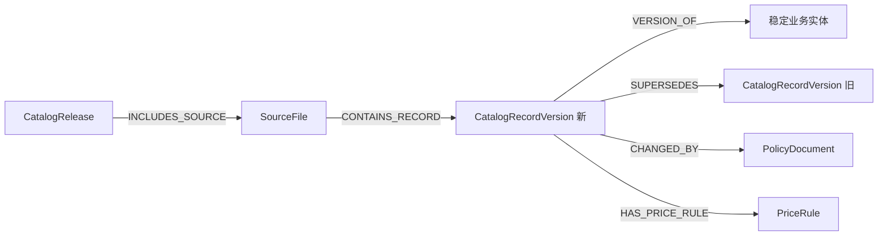

# 河南医保目录 Neo4j Cypher 生成指导

> 适用范围：河南省医疗服务项目、医用耗材映射库、基本物耗、谈判耗材、药品目录和诊疗目录。  
> 目标版本：Neo4j 5.x；示例仅使用原生 Cypher，不依赖 APOC。  
> 本文定义的是图模型、数据准备合同、Cypher 生成规则和验收标准，不包含数据库部署、Excel 清洗程序或生产导入操作。

## 1. 建设目标与边界

本知识图谱要同时回答四类问题：

1. 一个医疗服务项目对应哪些可收费耗材、基本物耗、医保支付类别、限价和政策依据？
2. 一个耗材基础代码、注册产品或具体 SKU 可以关联到哪些服务项目或服务范围？
3. 一个药品通用名下面有哪些具体药品、剂型、规格、生产企业、批准文号和支付规则？
4. 某个目录记录为何在某个时间生效、何时失效、由哪份政策变更、前后版本有什么差异？

图谱应保留三种不同层次，不能混成一层：

- **业务身份层**：项目、耗材、药品、机构、政策等稳定实体。
- **目录版本层**：每次下发文件中的具体记录及其生效区间。
- **证据与推断层**：原文明确关系、确定性派生关系、范围关系和待复核建议关系。

以下内容不应由 Cypher 临时完成：

- Excel 合并单元格、空白行、日期序列和多行表头解析。
- 中文名称模糊匹配、公司名称归一化和代码拆分。
- SHA-256 等稳定 ID 计算。
- 对未确认语义的数据进行自动纠错。

这些步骤必须在生成规范化 CSV 前完成，Cypher 只负责校验后的实体合并、版本入图和关系落图。

## 2. 数据源盘点与实际粒度

| 数据源 | 主要工作表 | 实际行粒度 | 已识别规模 | 主要用途 |
|---|---|---|---:|---|
| `1-河南服务项目目录（含映射库）-20260310（下发版）.xlsx` | 服务项目映射库、新增、停用 | 一个省级服务项目目录记录或目录说明行 | 7,113 个服务身份编码 | 服务项目、国家码迁移、加减收/扩展、支付和价格 |
| `2.河南省耗材映射库（2025年耗材目录）-20251013版+3月10日精神治疗等类整合项目.xlsx` | 耗材映射库、变更 | 一个“20 位基础代码 + 注册备案号”的产品映射记录 | 157,738 行 | 耗材产品、分类、注册、支付、服务映射 |
| `2-1.河南省耗材映射库（2025年耗材目录）-附件谈判子库-20251013版+3月10日精神治疗等类整合项目.xlsx` | 映射库谈判子库 | 一个 27 位具体 SKU | 94 行 | 可追踪到规格、型号的谈判耗材 |
| `2-2.河南省耗材映射库（2025年耗材目录）-基本物耗-20251013版+3月10日精神治疗等类整合项目.xlsx` | 基本物耗映射库 | 一个耗材产品与基本物耗/服务范围的映射记录 | 11,452 行 | 基本物耗分类及适用范围 |
| `药品目录模板202603.xlsx` | 药品目录模板 | 一个医保药品编码对应的具体药品目录记录 | 17,973 个药品产品、2,779 个通用名 | 药品、剂型、规格、企业、批准文号、价格 |
| `诊疗目录模板202509.xlsx` | 诊疗目录模板、二级代码对照、Sheet1 | 项目、目录分组或补充映射记录 | 约 111 条非空记录 | 服务补充属性、分类代码对照和历史映射 |

注意：`诊疗目录模板` 声明的 Excel 最大行数为 917,125，耗材“变更”表也可能声明到 1,048,576 行；这只是工作表维度，不是数据量。读取时必须以业务主键列非空为准，禁止用 `max_row` 直接生成节点。

### 2.1 已确认的数据基线

| 指标 | 基线值 |
|---|---:|
| 耗材源记录 | 157,738 |
| 20 位耗材基础代码 | 105,594 |
| `(耗材基础代码, 注册备案号)` 产品 | 155,579 |
| 注册备案标识 | 93,554 |
| 27 位谈判 SKU | 94 |
| 服务身份编码 | 7,113 |
| 拆分后的国家服务节点 | 5,983 |
| 药品产品 | 17,973 |
| 药品通用名 | 2,779 |
| 归一化机构 | 约 20,469 |
| 三个耗材库中的历史映射代码 | 548 |

耗材映射标记拆分后共有 456,670 次声明：

| 映射层级 | 数量 | 占比 | 入图方式 |
|---|---:|---:|---|
| 具体服务项目 | 195,715 | 42.86% | `ASSERTED_MAPS_TO_SERVICE` |
| 服务范围 | 260,621 | 57.07% | `APPLIES_TO_SCOPE` |
| 未解析 | 334 | 0.07% | 不生成业务边，进入复核队列 |

两个未解析代码是 `0131110b` 和 `01311201b`。334 是出现次数，不是不同代码数量。

## 3. 图谱的证据等级

每条非结构性关系必须有 `evidence_tier`，关系类型也应体现其语义强度。

| 等级 | 关系命名 | 使用条件 | 是否可作为确定事实 |
|---|---|---|---|
| A：原文明确 | `ASSERTED_*` | Excel 字段直接给出目标代码或明确写明主项/子项关系 | 是 |
| B：规则派生 | `DERIVED_*` | 代码规则、完整字典或严格文本规则能唯一推出关系 | 是，但必须记录规则和置信度 |
| C：范围适用 | `APPLIES_TO_SCOPE` | 映射目标是 `33ac`、`0133b` 等服务范围，不是具体项目 | 只能说明范围适用 |
| D：候选建议 | `SUGGESTED_*` | 名称相似、企业别名、疑似历史码或模型推荐 | 否，默认 `review_status='PENDING'` |

所有 A-D 级关系至少保留：

```text
assertion_id
source_file
source_sheet
source_row
source_column
raw_value
derivation_rule
confidence
review_status
valid_from
valid_to
release_id
```

`PRODUCT_OF`、`PARENT_OF`、`VERSION_OF` 等由稳定键或版本容器确定的结构关系，可以不重复整套断言字段；前提是其端点能够回溯到同一 `CatalogRecordVersion`。只要关系可能随目录变化、包含推断或存在多个来源，就必须使用 `assertion_id` 和完整证据字段。

不得把范围映射升级为具体项目事实。例如，耗材映射到 `33ac 内固定材料`，只表示其适用于这个服务范围；不能据此生成“该耗材被每一个名称或编码匹配的服务项目使用”的关系。

## 4. 核心节点模型

### 4.1 建议的 25 类核心节点

| 标签 | 唯一标识 | 说明 |
|---|---|---|
| `CatalogRelease` | `release_id` | 一次目录下发或整合版本 |
| `SourceFile` | `source_id` | 一个源文件/工作表来源 |
| `CatalogRecordVersion` | `version_id` | 某一业务实体在某次目录中的记录快照 |
| `PolicyDocument` | `policy_id` | 政策文件，保留规范号和原始号 |
| `PaymentCategory` | `payment_category_id` | 甲、乙、丙、丁等支付类别 |
| `PriceRule` | `price_rule_id` | 人群、地区、机构等级、限价、首付比例的时态规则 |
| `ServiceItem` | `service_item_id` | 河南省具体医疗服务项目 |
| `NationalServiceItem` | `national_service_id` | 拆分后的国家医疗服务项目 |
| `ServiceScope` | `scope_id` | `0133b`、`33ac` 等范围节点 |
| `FinancialCategory` | `financial_category_id` | 服务项目财务分类 |
| `ChargeUnit` | `unit_id` | 次、日、部位、疗程、盒、瓶等计价单位 |
| `ConsumableBase` | `base_code` | 20 位耗材基础代码 |
| `ConsumableProduct` | `product_id` | 基础代码与注册备案号组合确定的产品 |
| `ConsumableSku` | `sku_code` | 27 位谈判耗材 SKU |
| `ConsumableGenericName` | `consumable_generic_id` | 医保耗材通用名 |
| `ConsumableCategory` | `category_id` | 一级、二级、三级、通用名分类层级 |
| `Material` | `material_id` | 耗材材质代码及名称 |
| `Feature` | `feature_id` | 耗材特征代码及名称 |
| `RegistrationIdentifier` | `registration_id` | 医疗器械注册备案号 |
| `BasicMaterial` | `basic_material_id` | 冲洗工具等基本物耗概念 |
| `DrugGeneric` | `drug_generic_id` | 药品通用名 |
| `DrugProduct` | `drug_code` | 具体医保药品编码 |
| `DosageForm` | `dosage_form_id` | 溶液剂、片剂等剂型 |
| `RegulatoryIdentifier` | `regulatory_id` | 经校验的国药准字等药品批准标识 |
| `Organization` | `organization_id` | 生产企业、耗材企业、注册备案人等机构 |

`DataQualityIssue`、`ImportBatch`、`Alias` 可以作为治理扩展节点，但不应替代上述业务实体。

### 4.2 身份键规则

所有散列 ID 均在 CSV 准备阶段生成，不在 Cypher 中临时拼接。

| 实体 | 推荐 ID 规则 |
|---|---|
| 目录版本 | `henan:<domain>:<release_date>:<edition>` |
| 源文件 | `sha256(file_name + '|' + sheet_name)`；不要包含机器绝对路径 |
| 记录版本 | `sha256(source_id + '|' + source_row + '|' + record_hash)` |
| 服务项目 | 优先使用确认无冲突的省项目编码；冲突项使用受控的 `service_item_id` |
| 国家服务 | 拆分并规范化后的国家服务代码 |
| 耗材基础 | 20 位基础代码 |
| 耗材产品 | `sha256(base_code + '|' + registration_no)` |
| 谈判 SKU | 27 位耗材代码 |
| 药品产品 | 医保药品编码 |
| 通用名/剂型/单位 | `sha256(type + '|' + normalized_name)` |
| 机构 | `sha256('org|' + normalized_legal_name)` |
| 断言关系 | `sha256(source_id + '|' + source_row + '|' + source_column + '|' + raw_token)` |

耗材代码不能单独作为 `ConsumableProduct` 的键。157,738 行只形成 105,594 个基础代码，但形成 155,579 个“基础代码 + 注册备案号”产品。

机构归一化只允许做确定性处理，例如 Unicode 归一化、首尾空格清理和全半角统一。不能仅因去掉“有限公司”后名称相同就自动合并。

## 5. 核心关系字典

| 关系类型 | 起点 → 终点 | 语义 |
|---|---|---|
| `INCLUDES_SOURCE` | `CatalogRelease` → `SourceFile` | 版本包含源文件 |
| `CONTAINS_RECORD` | `SourceFile` → `CatalogRecordVersion` | 文件包含记录快照 |
| `VERSION_OF` | `CatalogRecordVersion` → 业务实体 | 快照属于稳定业务身份 |
| `SUPERSEDES` | 新快照 → 旧快照 | 新版本替代旧版本 |
| `CHANGED_BY` | 快照/价格规则 → `PolicyDocument` | 由政策引起或依据政策 |
| `HAS_PAYMENT_CATEGORY` | 快照/业务实体 → `PaymentCategory` | 支付分类 |
| `HAS_PRICE_RULE` | 快照/业务实体 → `PriceRule` | 价格或自付规则 |
| `IN_FINANCIAL_CATEGORY` | `ServiceItem` → `FinancialCategory` | 财务分类 |
| `USES_UNIT` | 服务/药品 → `ChargeUnit` | 计价或包装单位 |
| `MAPS_TO_NATIONAL` | `ServiceItem` → `NationalServiceItem` | 省项目映射国家项目 |
| `ASSERTED_SURCHARGE_OF` | 加收项目 → 主项目 | 原文明确的加收关系 |
| `ASSERTED_REDUCTION_OF` | 减收项目 → 主项目 | 原文明确的减收关系 |
| `ASSERTED_EXTENSION_OF` | 扩展项目 → 主项目 | 原文明确的扩展关系 |
| `DERIVED_SURCHARGE_OF` | 加收项目 → 主项目 | 规则派生的加收关系 |
| `DERIVED_REDUCTION_OF` | 减收项目 → 主项目 | 规则派生的减收关系 |
| `DERIVED_EXTENSION_OF` | 扩展项目 → 主项目 | 规则派生的扩展关系 |
| `PRODUCT_OF` | `ConsumableProduct` → `ConsumableBase` | 注册产品属于基础代码 |
| `HAS_CATEGORY` | 耗材基础 → 耗材分类 | 耗材分类 |
| `PARENT_OF` | 上级分类 → 下级分类 | 分类树 |
| `HAS_GENERIC` | 耗材基础/药品产品 → 通用名 | 对应通用名 |
| `HAS_MATERIAL` | 耗材基础 → `Material` | 材质 |
| `HAS_FEATURE` | 耗材基础 → `Feature` | 特征 |
| `REGISTERED_AS` | 耗材产品 → `RegistrationIdentifier` | 注册备案号 |
| `MANUFACTURED_BY` | 耗材/药品产品 → `Organization` | 生产或供应企业 |
| `REGISTRATION_HELD_BY` | 注册标识 → `Organization` | 注册备案人 |
| `HAS_SKU` | 耗材产品 → `ConsumableSku` | 具体规格型号 SKU |
| `ASSERTED_MAPS_TO_SERVICE` | 耗材产品 → `ServiceItem` | 明确映射具体服务项目 |
| `APPLIES_TO_SCOPE` | 耗材产品 → `ServiceScope` | 映射到服务范围 |
| `CLASSIFIED_AS_BASIC_MATERIAL` | 耗材产品 → `BasicMaterial` | 属于基本物耗概念 |
| `HAS_DOSAGE_FORM` | 药品产品 → `DosageForm` | 药品剂型 |
| `HAS_REGULATORY_IDENTIFIER` | 药品产品 → `RegulatoryIdentifier` | 合法药品批准标识 |
| `SUGGESTED_LINK` | 任意候选实体 → 任意候选实体 | 待复核的模糊关联 |

可选关系 `DERIVED_IN_SCOPE` 只允许在存在可信范围成员字典时生成，表示服务项目属于某个范围。禁止仅按字符串前缀猜测范围成员，更不能把它改写为耗材与具体服务之间的直接事实边。

## 6. 版本、时态与来源模型

稳定实体保存跨版本不变的身份；可能变化的名称、价格、支付类别、限价、备注和政策号进入 `CatalogRecordVersion` 或 `PriceRule`。



### 6.1 时态字段

| 字段 | 类型 | 说明 |
|---|---|---|
| `valid_from` | Neo4j `date` | 业务生效日期 |
| `valid_to` | Neo4j `date` 或 `null` | 业务终止日期，开区间时为空 |
| `handled_at` | Neo4j `date` | 经办日期 |
| `release_date` | Neo4j `date` | 目录发布日期/版本日 |
| `ingested_at` | Neo4j `datetime` | 入图时间 |
| `raw_valid_from` | 字符串 | 原始 Excel 值 |
| `raw_valid_to` | 字符串 | 原始 Excel 值 |

Excel 日期序列必须在预处理阶段转换。药品目录中的 1,140 个终止时间值为 `46142`，对应 `2026-04-30`；不能执行 `date('46142')`，也不能把它当作年份。

### 6.2 版本连接规则

1. 同一 `VERSION_OF` 实体的记录按已确认的 `release_rank` 和生效日期排序。
2. `SUPERSEDES` 只连接相邻版本，不连接所有历史版本。
3. 相同生效日但内容不同的记录不得自动决定先后，进入冲突复核。
4. 失效记录不删除稳定实体；通过版本的 `valid_to` 表达失效。
5. 更新当前显示属性时可以写到稳定实体，但权威历史仍以版本节点为准。

## 7. 耗材与服务的代码规则

### 7.1 耗材基础代码

20 位基础代码结构为：

```text
C + 一级2 + 二级2 + 三级2 + 通用名分类3 + 材质2 + 特征3 + 企业5
```

该规则已覆盖 157,738 条耗材源记录。分段值应与同一行的一级分类、二级分类、三级分类、材质、特征字段交叉校验；不一致时保留原值并进入数据质量队列。

谈判 SKU 规则为：

```text
20位耗材基础代码 + 7位SKU序号
```

94 条谈判子库记录全部符合。主耗材表的“规格”和“型号”为空，不能从“规格型号数”虚构 SKU；只有谈判子库可以生成 `ConsumableSku`。

### 7.2 服务项目变体

服务编码末三位可作为候选结构规则：

- `000`：通常是主项目。
- `001-099`：通常是加收或减收项目。
- `100+`：通常是扩展项目。

但“通常”不等于事实。只有原文的加收项、扩展项、项目名称或完整业务规则能够确认时，才生成 `ASSERTED_*`；仅由编码结构和文本规则推出时，生成 `DERIVED_*` 并记录 `derivation_rule`。

当前分析可形成 302 条加收、6 条减收和 73 条明确扩展关系。8 个服务编码存在碰撞，必须在生成 `service_item_id` 前复核，不能直接 `MERGE` 到同一个节点后覆盖名称。

### 7.3 国家服务代码拆分

`国家医疗服务项目代码` 的处理顺序：

1. 对 `国家新码-河南旧码` 形式拆成国家码和旧省码，旧省码保留在关系属性。
2. 对与省码相同的单一国家码仍创建国家节点和映射边，不能因字符串相同省略语义层。
3. 对不同的单一国家码直接创建映射。
4. 空值不创建国家节点。

数据分布为：5,707 条复合码、1,304 条国家/省级代码相同、27 条不同的单一国家码、92 条空值。拆分后形成 5,983 个国家服务节点。

## 8. 规范化 CSV 合同

### 8.1 通用要求

- 编码统一按字符串输出，不能让 Excel 或 CSV 工具转成科学计数法。
- 文件编码使用 UTF-8，无 BOM 或有 BOM 均可，但一个批次必须一致。
- 空值输出为空字符串；Cypher 使用 `CASE trim(value) WHEN '' THEN null ELSE ... END`。
- 日期统一为 `YYYY-MM-DD`，并额外保留 `raw_*` 字段。
- 比例统一为小数，例如 `0.2`，不能混入 `20%`。
- 金额不带逗号和货币符号，保留原始精度。
- 多值字段必须在 CSV 准备阶段拆成一行一条边，禁止把逗号分隔字符串存成关系数组。
- 每行包含 `release_id`、`source_id`、`source_file`、`source_sheet`、`source_row`、`record_hash`。

### 8.2 推荐文件

| CSV | 一行代表 | 关键字段 |
|---|---|---|
| `catalog_releases.csv` | 一个目录版本 | `release_id,domain,edition,release_date` |
| `source_files.csv` | 一个源文件/工作表 | `source_id,release_id,file_name,sheet_name,file_sha256` |
| `service_items.csv` | 一个服务目录记录版本 | `service_item_id,province_code,name,...,version_id,valid_from,valid_to` |
| `service_national_edges.csv` | 一个省码到国家码断言 | `assertion_id,service_item_id,national_service_id,legacy_code,...` |
| `service_variant_edges.csv` | 一个主子项目关系 | `assertion_id,child_id,parent_id,relation_kind,evidence_tier,...` |
| `price_rules.csv` | 一个对象在一个维度下的价格规则 | `price_rule_id,owner_id,owner_label,population,region_tier,max_price,copay_ratio,...` |
| `consumable_bases.csv` | 一个 20 位耗材基础代码 | `base_code,category_l1_id,...,generic_id,material_id,feature_id` |
| `consumable_products.csv` | 一个基础代码与注册号组合 | `product_id,base_code,registration_id,product_name,manufacturer_id,holder_id,...` |
| `consumable_skus.csv` | 一个 27 位具体 SKU | `sku_code,product_id,specification,model,...` |
| `consumable_service_edges.csv` | 一次具体服务映射断言 | `assertion_id,product_id,service_item_id,raw_mapping_token,...` |
| `consumable_scope_edges.csv` | 一次服务范围映射断言 | `assertion_id,product_id,scope_id,scope_name,raw_mapping_token,...` |
| `consumable_basic_material_edges.csv` | 一次基本物耗断言 | `assertion_id,product_id,basic_material_id,basic_material_name,restriction_scope,...` |
| `unresolved_mappings.csv` | 一次无法解析的映射 | `assertion_id,product_id,raw_mapping_token,reason,...` |
| `drug_products.csv` | 一个药品记录版本 | `drug_code,generic_id,dosage_form_id,manufacturer_id,regulatory_id,...` |
| `policies.csv` | 一份规范化政策 | `policy_id,normalized_policy_no,raw_policy_no,title` |
| `version_edges.csv` | 一条相邻版本替代关系 | `new_version_id,old_version_id,derivation_rule` |

`owner_label`、`relation_kind` 等字段只用于在生成阶段分流到固定模板，不能直接插值成 Cypher 标签或关系类型。动态结构必须经过允许列表。

### 8.3 关系来源字段

建议每个关系 CSV 统一追加：

```csv
assertion_id,release_id,source_file,source_sheet,source_row,source_column,raw_value,derivation_rule,confidence,review_status,valid_from,valid_to
```

同一对节点可能在多个文件或多行被重复声明。关系 `MERGE` 时必须把 `assertion_id` 放入关系键，不能只按起点和终点合并，否则会丢失证据数量和来源。

## 9. Neo4j 约束和索引

先执行唯一约束，再导入实体。以下约束均可重复执行。

```cypher
CREATE CONSTRAINT catalog_release_id IF NOT EXISTS
FOR (n:CatalogRelease) REQUIRE n.release_id IS UNIQUE;

CREATE CONSTRAINT source_file_id IF NOT EXISTS
FOR (n:SourceFile) REQUIRE n.source_id IS UNIQUE;

CREATE CONSTRAINT catalog_record_version_id IF NOT EXISTS
FOR (n:CatalogRecordVersion) REQUIRE n.version_id IS UNIQUE;

CREATE CONSTRAINT service_item_id IF NOT EXISTS
FOR (n:ServiceItem) REQUIRE n.service_item_id IS UNIQUE;

CREATE CONSTRAINT national_service_id IF NOT EXISTS
FOR (n:NationalServiceItem) REQUIRE n.national_service_id IS UNIQUE;

CREATE CONSTRAINT service_scope_id IF NOT EXISTS
FOR (n:ServiceScope) REQUIRE n.scope_id IS UNIQUE;

CREATE CONSTRAINT consumable_base_code IF NOT EXISTS
FOR (n:ConsumableBase) REQUIRE n.base_code IS UNIQUE;

CREATE CONSTRAINT consumable_product_id IF NOT EXISTS
FOR (n:ConsumableProduct) REQUIRE n.product_id IS UNIQUE;

CREATE CONSTRAINT consumable_sku_code IF NOT EXISTS
FOR (n:ConsumableSku) REQUIRE n.sku_code IS UNIQUE;

CREATE CONSTRAINT registration_identifier_id IF NOT EXISTS
FOR (n:RegistrationIdentifier) REQUIRE n.registration_id IS UNIQUE;

CREATE CONSTRAINT drug_product_code IF NOT EXISTS
FOR (n:DrugProduct) REQUIRE n.drug_code IS UNIQUE;

CREATE CONSTRAINT drug_generic_id IF NOT EXISTS
FOR (n:DrugGeneric) REQUIRE n.drug_generic_id IS UNIQUE;

CREATE CONSTRAINT organization_id IF NOT EXISTS
FOR (n:Organization) REQUIRE n.organization_id IS UNIQUE;

CREATE CONSTRAINT policy_document_id IF NOT EXISTS
FOR (n:PolicyDocument) REQUIRE n.policy_id IS UNIQUE;

CREATE CONSTRAINT price_rule_id IF NOT EXISTS
FOR (n:PriceRule) REQUIRE n.price_rule_id IS UNIQUE;

CREATE CONSTRAINT payment_category_id IF NOT EXISTS
FOR (n:PaymentCategory) REQUIRE n.payment_category_id IS UNIQUE;

CREATE CONSTRAINT financial_category_id IF NOT EXISTS
FOR (n:FinancialCategory) REQUIRE n.financial_category_id IS UNIQUE;

CREATE CONSTRAINT charge_unit_id IF NOT EXISTS
FOR (n:ChargeUnit) REQUIRE n.unit_id IS UNIQUE;

CREATE CONSTRAINT consumable_category_id IF NOT EXISTS
FOR (n:ConsumableCategory) REQUIRE n.category_id IS UNIQUE;

CREATE CONSTRAINT consumable_generic_id IF NOT EXISTS
FOR (n:ConsumableGenericName) REQUIRE n.consumable_generic_id IS UNIQUE;

CREATE CONSTRAINT consumable_material_id IF NOT EXISTS
FOR (n:Material) REQUIRE n.material_id IS UNIQUE;

CREATE CONSTRAINT consumable_feature_id IF NOT EXISTS
FOR (n:Feature) REQUIRE n.feature_id IS UNIQUE;

CREATE CONSTRAINT basic_material_id IF NOT EXISTS
FOR (n:BasicMaterial) REQUIRE n.basic_material_id IS UNIQUE;

CREATE CONSTRAINT dosage_form_id IF NOT EXISTS
FOR (n:DosageForm) REQUIRE n.dosage_form_id IS UNIQUE;

CREATE CONSTRAINT regulatory_identifier_id IF NOT EXISTS
FOR (n:RegulatoryIdentifier) REQUIRE n.regulatory_id IS UNIQUE;
```

补充查询索引：

```cypher
CREATE RANGE INDEX service_item_province_code IF NOT EXISTS
FOR (n:ServiceItem) ON (n.province_code);

CREATE RANGE INDEX consumable_product_registration_no IF NOT EXISTS
FOR (n:ConsumableProduct) ON (n.registration_no);

CREATE RANGE INDEX record_validity IF NOT EXISTS
FOR (n:CatalogRecordVersion) ON (n.valid_from, n.valid_to);

CREATE RANGE INDEX policy_number IF NOT EXISTS
FOR (n:PolicyDocument) ON (n.normalized_policy_no);

CREATE FULLTEXT INDEX medical_catalog_names IF NOT EXISTS
FOR (n:ServiceItem|ConsumableProduct|DrugProduct)
ON EACH [n.name, n.product_name, n.generic_name, n.trade_name];
```

不要创建“所有属性组合唯一”的约束。业务唯一性必须落在预先生成的稳定 ID 上。

## 10. 通用参数化写入模板

### 10.1 目录版本和源文件

```cypher
MERGE (r:CatalogRelease {release_id: $row.release_id})
ON CREATE SET
  r.domain = $row.domain,
  r.edition = $row.edition,
  r.release_date = date($row.release_date),
  r.created_at = datetime()
ON MATCH SET r.last_seen_at = datetime();

MERGE (f:SourceFile {source_id: $row.source_id})
ON CREATE SET
  f.file_name = $row.file_name,
  f.sheet_name = $row.sheet_name,
  f.file_sha256 = $row.file_sha256,
  f.created_at = datetime()
MERGE (r)-[:INCLUDES_SOURCE]->(f);
```

### 10.2 记录版本

```cypher
MATCH (f:SourceFile {source_id: $row.source_id})
MATCH (e:ServiceItem {service_item_id: $row.entity_id})
MERGE (v:CatalogRecordVersion {version_id: $row.version_id})
ON CREATE SET
  v.domain = $row.domain,
  v.record_hash = $row.record_hash,
  v.source_row = toInteger($row.source_row),
  v.valid_from = CASE trim(coalesce($row.valid_from, '')) WHEN '' THEN null ELSE date($row.valid_from) END,
  v.valid_to = CASE trim(coalesce($row.valid_to, '')) WHEN '' THEN null ELSE date($row.valid_to) END,
  v.raw_valid_from = $row.raw_valid_from,
  v.raw_valid_to = $row.raw_valid_to,
  v.release_rank = toInteger($row.release_rank),
  v.ingested_at = datetime()
ON MATCH SET v.last_seen_at = datetime()
MERGE (f)-[:CONTAINS_RECORD]->(v)
MERGE (v)-[:VERSION_OF]->(e);
```

上例以服务项目为端点。实际生成时必须按允许标签拆成固定模板，例如分别生成 `MATCH (e:ServiceItem ...)`、`MATCH (e:ConsumableProduct ...)` 和 `MATCH (e:DrugProduct ...)`，不要接受外部输入直接替换标签。

### 10.3 相邻版本

```cypher
MATCH (new:CatalogRecordVersion {version_id: $row.new_version_id})
MATCH (old:CatalogRecordVersion {version_id: $row.old_version_id})
MERGE (new)-[r:SUPERSEDES]->(old)
ON CREATE SET
  r.derivation_rule = $row.derivation_rule,
  r.created_at = datetime();
```

`version_edges.csv` 应由排序后的版本数据生成。不要用全图笛卡尔比较在导入时猜测前序版本。

## 11. 批量导入模式

Neo4j 5.x 推荐使用子查询事务。CSV 放入 Neo4j `server.directories.import` 允许的目录后执行：

```cypher
LOAD CSV WITH HEADERS FROM 'file:///catalog_releases.csv' AS row
CALL {
  WITH row
  MERGE (r:CatalogRelease {release_id: row.release_id})
  ON CREATE SET
    r.domain = row.domain,
    r.edition = row.edition,
    r.release_date = date(row.release_date),
    r.created_at = datetime()
  ON MATCH SET r.last_seen_at = datetime()
} IN TRANSACTIONS OF 1000 ROWS;
```

大表建议批次：

| 数据 | 建议批次 |
|---|---:|
| 节点和版本 | 2,000-5,000 行 |
| 关系断言 | 5,000-10,000 行 |
| 包含长文本的服务项目 | 500-1,000 行 |

批次大小需要根据 Neo4j 堆内存、页面缓存和最长文本实测调整。失败后使用同一 CSV 重试；所有写入必须幂等。

## 12. 服务项目 Cypher

### 12.1 服务项目和版本

```cypher
LOAD CSV WITH HEADERS FROM 'file:///service_items.csv' AS row
CALL {
  WITH row
  MATCH (f:SourceFile {source_id: row.source_id})
  MERGE (s:ServiceItem {service_item_id: row.service_item_id})
  ON CREATE SET
    s.province_code = row.province_code,
    s.created_at = datetime()
  SET
    s.name = row.name,
    s.pinyin_code = CASE trim(row.pinyin_code) WHEN '' THEN null ELSE row.pinyin_code END,
    s.last_seen_release = row.release_id

  MERGE (v:CatalogRecordVersion {version_id: row.version_id})
  ON CREATE SET
    v.domain = 'SERVICE',
    v.name = row.name,
    v.content = row.content,
    v.exclusions = row.exclusions,
    v.service_output = row.service_output,
    v.price_components = row.price_components,
    v.surcharge_text = row.surcharge_text,
    v.extension_text = row.extension_text,
    v.description = row.description,
    v.payment_note = row.payment_note,
    v.record_hash = row.record_hash,
    v.valid_from = CASE trim(row.valid_from) WHEN '' THEN null ELSE date(row.valid_from) END,
    v.valid_to = CASE trim(row.valid_to) WHEN '' THEN null ELSE date(row.valid_to) END,
    v.source_row = toInteger(row.source_row),
    v.ingested_at = datetime()

  MERGE (f)-[:CONTAINS_RECORD]->(v)
  MERGE (v)-[:VERSION_OF]->(s)
} IN TRANSACTIONS OF 1000 ROWS;
```

目录中的章节说明行没有服务项目编码时，不创建 `ServiceItem`。可把它保存在版本发布说明、`ServiceScope` 描述或单独的 `CatalogSection` 扩展节点中。

### 12.2 国家码关系

```cypher
LOAD CSV WITH HEADERS FROM 'file:///service_national_edges.csv' AS row
CALL {
  WITH row
  MATCH (s:ServiceItem {service_item_id: row.service_item_id})
  MERGE (n:NationalServiceItem {national_service_id: row.national_service_id})
  ON CREATE SET n.name = row.national_name, n.created_at = datetime()
  MERGE (s)-[r:MAPS_TO_NATIONAL {assertion_id: row.assertion_id}]->(n)
  ON CREATE SET
    r.legacy_provincial_code = CASE trim(row.legacy_code) WHEN '' THEN null ELSE row.legacy_code END,
    r.source_file = row.source_file,
    r.source_sheet = row.source_sheet,
    r.source_row = toInteger(row.source_row),
    r.raw_value = row.raw_value,
    r.evidence_tier = 'ASSERTED',
    r.confidence = 1.0,
    r.review_status = 'ACCEPTED',
    r.release_id = row.release_id
} IN TRANSACTIONS OF 5000 ROWS;
```

### 12.3 加收、减收和扩展

关系类型必须由生成器按允许列表分流。下面是加收模板；减收和扩展分别替换为固定的 `ASSERTED_REDUCTION_OF`、`ASSERTED_EXTENSION_OF`、`DERIVED_*`。

```cypher
LOAD CSV WITH HEADERS FROM 'file:///service_asserted_surcharge_edges.csv' AS row
CALL {
  WITH row
  MATCH (child:ServiceItem {service_item_id: row.child_id})
  MATCH (parent:ServiceItem {service_item_id: row.parent_id})
  MERGE (child)-[r:ASSERTED_SURCHARGE_OF {assertion_id: row.assertion_id}]->(parent)
  ON CREATE SET
    r.source_file = row.source_file,
    r.source_sheet = row.source_sheet,
    r.source_row = toInteger(row.source_row),
    r.raw_value = row.raw_value,
    r.derivation_rule = row.derivation_rule,
    r.evidence_tier = 'ASSERTED',
    r.confidence = toFloat(row.confidence),
    r.review_status = row.review_status,
    r.valid_from = CASE trim(row.valid_from) WHEN '' THEN null ELSE date(row.valid_from) END,
    r.valid_to = CASE trim(row.valid_to) WHEN '' THEN null ELSE date(row.valid_to) END
} IN TRANSACTIONS OF 5000 ROWS;
```

## 13. 耗材 Cypher

### 13.1 基础代码、分类、材质和特征

```cypher
LOAD CSV WITH HEADERS FROM 'file:///consumable_bases.csv' AS row
CALL {
  WITH row
  MERGE (b:ConsumableBase {base_code: row.base_code})
  ON CREATE SET
    b.code_rule_valid = toBoolean(row.code_rule_valid),
    b.created_at = datetime()
  SET b.last_seen_release = row.release_id

  MERGE (l1:ConsumableCategory {category_id: row.category_l1_id})
  SET l1.level = 1, l1.name = row.category_l1_name
  MERGE (l2:ConsumableCategory {category_id: row.category_l2_id})
  SET l2.level = 2, l2.name = row.category_l2_name
  MERGE (l3:ConsumableCategory {category_id: row.category_l3_id})
  SET l3.level = 3, l3.name = row.category_l3_name
  MERGE (gc:ConsumableCategory {category_id: row.generic_category_id})
  SET gc.level = 4, gc.name = row.generic_category_name

  MERGE (l1)-[:PARENT_OF]->(l2)
  MERGE (l2)-[:PARENT_OF]->(l3)
  MERGE (l3)-[:PARENT_OF]->(gc)
  MERGE (b)-[:HAS_CATEGORY]->(gc)

  FOREACH (_ IN CASE trim(row.material_id) WHEN '' THEN [] ELSE [1] END |
    MERGE (m:Material {material_id: row.material_id})
    SET m.name = row.material_name
    MERGE (b)-[:HAS_MATERIAL]->(m)
  )

  FOREACH (_ IN CASE trim(row.feature_id) WHEN '' THEN [] ELSE [1] END |
    MERGE (f:Feature {feature_id: row.feature_id})
    SET f.name = row.feature_name
    MERGE (b)-[:HAS_FEATURE]->(f)
  )
} IN TRANSACTIONS OF 5000 ROWS;
```

### 13.2 注册产品、企业和注册备案人

```cypher
LOAD CSV WITH HEADERS FROM 'file:///consumable_products.csv' AS row
CALL {
  WITH row
  MATCH (b:ConsumableBase {base_code: row.base_code})
  MERGE (p:ConsumableProduct {product_id: row.product_id})
  ON CREATE SET
    p.base_code = row.base_code,
    p.registration_no = row.registration_no,
    p.created_at = datetime()
  SET
    p.product_name = row.product_name,
    p.spec_model_count = CASE trim(row.spec_model_count) WHEN '' THEN null ELSE toInteger(row.spec_model_count) END,
    p.last_seen_release = row.release_id
  MERGE (p)-[:PRODUCT_OF]->(b)

  FOREACH (_ IN CASE trim(row.registration_id) WHEN '' THEN [] ELSE [1] END |
    MERGE (reg:RegistrationIdentifier {registration_id: row.registration_id})
    SET reg.raw_value = row.registration_no
    MERGE (p)-[:REGISTERED_AS]->(reg)
  )

  FOREACH (_ IN CASE trim(row.manufacturer_id) WHEN '' THEN [] ELSE [1] END |
    MERGE (org:Organization {organization_id: row.manufacturer_id})
    SET org.normalized_name = row.manufacturer_normalized,
        org.last_raw_name = row.manufacturer_raw
    MERGE (p)-[:MANUFACTURED_BY]->(org)
  )

  FOREACH (_ IN CASE
    WHEN trim(row.holder_id) <> '' AND trim(row.registration_id) <> '' THEN [1]
    ELSE []
  END |
    MERGE (holder:Organization {organization_id: row.holder_id})
    SET holder.normalized_name = row.holder_normalized,
        holder.last_raw_name = row.holder_raw
    MERGE (reg:RegistrationIdentifier {registration_id: row.registration_id})
    MERGE (reg)-[:REGISTRATION_HELD_BY]->(holder)
  )
} IN TRANSACTIONS OF 5000 ROWS;
```

如果注册备案号为空，不应创建一个共享的“空注册号”节点。预处理阶段应给产品分配明确的缺失值策略，并标记 `registration_missing=true`。

### 13.3 谈判 SKU

```cypher
LOAD CSV WITH HEADERS FROM 'file:///consumable_skus.csv' AS row
CALL {
  WITH row
  MATCH (p:ConsumableProduct {product_id: row.product_id})
  MERGE (sku:ConsumableSku {sku_code: row.sku_code})
  ON CREATE SET sku.created_at = datetime()
  SET
    sku.specification = row.specification,
    sku.model = row.model,
    sku.payment_category = row.payment_category,
    sku.max_price = CASE trim(row.max_price) WHEN '' THEN null ELSE toFloat(row.max_price) END,
    sku.valid_from = CASE trim(row.valid_from) WHEN '' THEN null ELSE date(row.valid_from) END,
    sku.valid_to = CASE trim(row.valid_to) WHEN '' THEN null ELSE date(row.valid_to) END
  MERGE (p)-[:HAS_SKU]->(sku)
} IN TRANSACTIONS OF 1000 ROWS;
```

### 13.4 具体项目映射

```cypher
LOAD CSV WITH HEADERS FROM 'file:///consumable_service_edges.csv' AS row
CALL {
  WITH row
  MATCH (p:ConsumableProduct {product_id: row.product_id})
  MATCH (s:ServiceItem {service_item_id: row.service_item_id})
  MERGE (p)-[r:ASSERTED_MAPS_TO_SERVICE {assertion_id: row.assertion_id}]->(s)
  ON CREATE SET
    r.raw_mapping_token = row.raw_mapping_token,
    r.source_file = row.source_file,
    r.source_sheet = row.source_sheet,
    r.source_row = toInteger(row.source_row),
    r.source_column = row.source_column,
    r.evidence_tier = 'ASSERTED',
    r.confidence = 1.0,
    r.review_status = 'ACCEPTED',
    r.valid_from = CASE trim(row.valid_from) WHEN '' THEN null ELSE date(row.valid_from) END,
    r.valid_to = CASE trim(row.valid_to) WHEN '' THEN null ELSE date(row.valid_to) END,
    r.release_id = row.release_id
} IN TRANSACTIONS OF 10000 ROWS;
```

### 13.5 范围映射

```cypher
LOAD CSV WITH HEADERS FROM 'file:///consumable_scope_edges.csv' AS row
CALL {
  WITH row
  MATCH (p:ConsumableProduct {product_id: row.product_id})
  MERGE (scope:ServiceScope {scope_id: row.scope_id})
  ON CREATE SET scope.code = row.scope_code, scope.created_at = datetime()
  SET scope.name = row.scope_name
  MERGE (p)-[r:APPLIES_TO_SCOPE {assertion_id: row.assertion_id}]->(scope)
  ON CREATE SET
    r.raw_mapping_token = row.raw_mapping_token,
    r.source_file = row.source_file,
    r.source_sheet = row.source_sheet,
    r.source_row = toInteger(row.source_row),
    r.source_column = row.source_column,
    r.evidence_tier = 'SCOPE',
    r.derivation_rule = row.derivation_rule,
    r.confidence = toFloat(row.confidence),
    r.review_status = row.review_status,
    r.valid_from = CASE trim(row.valid_from) WHEN '' THEN null ELSE date(row.valid_from) END,
    r.valid_to = CASE trim(row.valid_to) WHEN '' THEN null ELSE date(row.valid_to) END,
    r.release_id = row.release_id
} IN TRANSACTIONS OF 10000 ROWS;
```

### 13.6 基本物耗

```cypher
LOAD CSV WITH HEADERS FROM 'file:///consumable_basic_material_edges.csv' AS row
CALL {
  WITH row
  MATCH (p:ConsumableProduct {product_id: row.product_id})
  MERGE (b:BasicMaterial {basic_material_id: row.basic_material_id})
  ON CREATE SET b.name = row.basic_material_name, b.created_at = datetime()
  MERGE (p)-[r:CLASSIFIED_AS_BASIC_MATERIAL {assertion_id: row.assertion_id}]->(b)
  ON CREATE SET
    r.restriction_scope = row.restriction_scope,
    r.raw_value = row.raw_value,
    r.source_file = row.source_file,
    r.source_sheet = row.source_sheet,
    r.source_row = toInteger(row.source_row),
    r.evidence_tier = 'ASSERTED',
    r.confidence = 1.0,
    r.review_status = 'ACCEPTED',
    r.valid_from = CASE trim(row.valid_from) WHEN '' THEN null ELSE date(row.valid_from) END
} IN TRANSACTIONS OF 5000 ROWS;
```

“基本物耗”与“映射结果”是两个不同维度：前者形成 `BasicMaterial`，后者仍按具体项目/服务范围规则拆边。

## 14. 药品 Cypher

### 14.1 药品通用名、产品、剂型和企业

```cypher
LOAD CSV WITH HEADERS FROM 'file:///drug_products.csv' AS row
CALL {
  WITH row
  MERGE (g:DrugGeneric {drug_generic_id: row.generic_id})
  ON CREATE SET g.name = row.generic_name, g.created_at = datetime()

  MERGE (d:DrugProduct {drug_code: row.drug_code})
  ON CREATE SET d.created_at = datetime()
  SET
    d.generic_name = row.generic_name,
    d.english_name = CASE trim(row.english_name) WHEN '' THEN null ELSE row.english_name END,
    d.trade_name = CASE trim(row.trade_name) WHEN '' THEN null ELSE row.trade_name END,
    d.specification = row.specification,
    d.unit = row.unit,
    d.max_price = CASE trim(row.max_price) WHEN '' THEN null ELSE toFloat(row.max_price) END,
    d.max_price_review_required = toBoolean(row.max_price_review_required),
    d.valid_from = CASE trim(row.valid_from) WHEN '' THEN null ELSE date(row.valid_from) END,
    d.valid_to = CASE trim(row.valid_to) WHEN '' THEN null ELSE date(row.valid_to) END,
    d.last_seen_release = row.release_id
  MERGE (d)-[:HAS_GENERIC]->(g)

  FOREACH (_ IN CASE trim(row.dosage_form_id) WHEN '' THEN [] ELSE [1] END |
    MERGE (form:DosageForm {dosage_form_id: row.dosage_form_id})
    SET form.name = row.dosage_form
    MERGE (d)-[:HAS_DOSAGE_FORM]->(form)
  )

  FOREACH (_ IN CASE trim(row.manufacturer_id) WHEN '' THEN [] ELSE [1] END |
    MERGE (org:Organization {organization_id: row.manufacturer_id})
    SET org.normalized_name = row.manufacturer_normalized,
        org.last_raw_name = row.manufacturer_raw
    MERGE (d)-[:MANUFACTURED_BY]->(org)
  )
} IN TRANSACTIONS OF 5000 ROWS;
```

### 14.2 药品批准标识

只有通过格式与语义校验的值才进入 `RegulatoryIdentifier`：

```cypher
LOAD CSV WITH HEADERS FROM 'file:///drug_regulatory_edges.csv' AS row
CALL {
  WITH row
  MATCH (d:DrugProduct {drug_code: row.drug_code})
  MERGE (r:RegulatoryIdentifier {regulatory_id: row.regulatory_id})
  ON CREATE SET
    r.identifier_type = row.identifier_type,
    r.normalized_value = row.normalized_value,
    r.raw_value = row.raw_value,
    r.created_at = datetime()
  MERGE (d)-[e:HAS_REGULATORY_IDENTIFIER {assertion_id: row.assertion_id}]->(r)
  ON CREATE SET
    e.source_file = row.source_file,
    e.source_sheet = row.source_sheet,
    e.source_row = toInteger(row.source_row),
    e.evidence_tier = 'ASSERTED',
    e.review_status = 'ACCEPTED'
} IN TRANSACTIONS OF 5000 ROWS;
```

药品“国药准字”列中有 2,071 个值实际上是医保政策号。这些值不能创建 `RegulatoryIdentifier`，应进入政策候选或数据质量队列，经确认后才创建 `PolicyDocument`。

## 15. 支付类别、价格和政策 Cypher

价格不能仅作为服务、耗材或药品节点上的一个 `price` 属性，因为同一对象可能按人群、地区、医院等级和时间有多套规则。

### 15.1 政策

```cypher
LOAD CSV WITH HEADERS FROM 'file:///policies.csv' AS row
CALL {
  WITH row
  MERGE (p:PolicyDocument {policy_id: row.policy_id})
  ON CREATE SET p.created_at = datetime()
  SET
    p.normalized_policy_no = row.normalized_policy_no,
    p.raw_policy_no = row.raw_policy_no,
    p.title = CASE trim(row.title) WHEN '' THEN null ELSE row.title END,
    p.review_status = row.review_status
} IN TRANSACTIONS OF 1000 ROWS;
```

5 个政策号使用了异常括号形式 `〔2024)74号`。应保留 `raw_policy_no`；只有人工确认后才把规范候选写入 `normalized_policy_no`，不能静默替换。

### 15.2 支付类别

支付类别先做受控字典归一化，例如将源字段中的空格和换行清理后再生成 `payment_category_id`。未知值不能自动归入甲、乙、丙、丁。

```cypher
LOAD CSV WITH HEADERS FROM 'file:///service_payment_categories.csv' AS row
CALL {
  WITH row
  MATCH (v:CatalogRecordVersion {version_id: row.version_id})
  MERGE (pc:PaymentCategory {payment_category_id: row.payment_category_id})
  ON CREATE SET
    pc.code = row.payment_category_code,
    pc.name = row.payment_category_name,
    pc.created_at = datetime()
  MERGE (v)-[r:HAS_PAYMENT_CATEGORY {assertion_id: row.assertion_id}]->(pc)
  ON CREATE SET
    r.source_file = row.source_file,
    r.source_sheet = row.source_sheet,
    r.source_row = toInteger(row.source_row),
    r.raw_value = row.raw_value,
    r.evidence_tier = 'ASSERTED',
    r.review_status = 'ACCEPTED',
    r.valid_from = CASE trim(row.valid_from) WHEN '' THEN null ELSE date(row.valid_from) END,
    r.valid_to = CASE trim(row.valid_to) WHEN '' THEN null ELSE date(row.valid_to) END
} IN TRANSACTIONS OF 5000 ROWS;
```

支付类别应优先连接记录版本，避免目录更新后稳定实体同时挂有互相冲突的历史类别。查询“当前类别”时按有效期选择版本。

### 15.3 价格规则

生成器必须根据 `owner_label` 分流成固定 Cypher。以下为服务项目模板：

```cypher
LOAD CSV WITH HEADERS FROM 'file:///service_price_rules.csv' AS row
CALL {
  WITH row
  MATCH (s:ServiceItem {service_item_id: row.owner_id})
  MERGE (pr:PriceRule {price_rule_id: row.price_rule_id})
  ON CREATE SET pr.created_at = datetime()
  SET
    pr.population = row.population,
    pr.region_tier = row.region_tier,
    pr.hospital_tier = row.hospital_tier,
    pr.max_price = CASE trim(row.max_price) WHEN '' THEN null ELSE toFloat(row.max_price) END,
    pr.copay_ratio = CASE trim(row.copay_ratio) WHEN '' THEN null ELSE toFloat(row.copay_ratio) END,
    pr.valid_from = CASE trim(row.valid_from) WHEN '' THEN null ELSE date(row.valid_from) END,
    pr.valid_to = CASE trim(row.valid_to) WHEN '' THEN null ELSE date(row.valid_to) END,
    pr.raw_value = row.raw_value,
    pr.source_file = row.source_file,
    pr.source_sheet = row.source_sheet,
    pr.source_row = toInteger(row.source_row)
  MERGE (s)-[:HAS_PRICE_RULE]->(pr)

  FOREACH (_ IN CASE trim(row.policy_id) WHEN '' THEN [] ELSE [1] END |
    MERGE (policy:PolicyDocument {policy_id: row.policy_id})
    MERGE (pr)-[:CHANGED_BY]->(policy)
  )
} IN TRANSACTIONS OF 5000 ROWS;
```

服务目录中的市级、县/区级和乡级价格列在当前文件中全为空。不要据此创建金额为 0 的价格规则；空值表示“没有提供”，不是“价格为零”。

药品目录中 9,395/17,973 条最高价格为 `40000`。在业务含义确认前保留原值并设置 `max_price_review_required=true`，不能假设它一定是实际最高价或无限额占位值。

## 16. 幂等、重试和错误处理

### 16.1 幂等原则

1. 节点只用稳定唯一 ID 执行 `MERGE`。
2. 多来源关系使用 `assertion_id` 作为关系键。
3. 不把 `created_at`、`valid_from`、名称或价格放进 `MERGE` 键。
4. 版本节点在 `ON CREATE` 写入不可变快照，重跑只更新 `last_seen_at`。
5. 若同一 `version_id` 对应不同 `record_hash`，立即失败，不允许覆盖。

冲突检查：

```cypher
MATCH (v:CatalogRecordVersion {version_id: $row.version_id})
WHERE v.record_hash <> $row.record_hash
RETURN v.version_id AS version_id,
       v.record_hash AS stored_hash,
       $row.record_hash AS incoming_hash;
```

### 16.2 推荐导入顺序

1. 约束和索引。
2. `CatalogRelease`、`SourceFile`、政策、支付类别、单位和分类字典。
3. 服务、耗材、药品稳定实体。
4. `CatalogRecordVersion` 和版本关系。
5. 注册、企业、剂型、通用名等结构关系。
6. 具体服务映射、范围映射和基本物耗关系。
7. 价格规则和政策关系。
8. 校验查询和复核队列。

### 16.3 失败处理

- 预处理阶段输出 `accepted.csv`、`rejected.csv` 和 `audit.json`。
- Neo4j 导入失败时记录文件名、批次范围和异常，不修改源 Excel。
- 缺少端点的边不能创建占位业务节点，应进入 `rejected.csv`。
- 允许同一批次整批重跑，不需要先删除已经成功的节点。
- 删除或回滚必须以 `release_id` 和导入批次为明确边界，不能按模糊标签批量删除。

## 17. 验收与数据质量 Cypher

### 17.1 核心节点计数

```cypher
MATCH (n:ConsumableBase)
RETURN 'ConsumableBase' AS type, count(n) AS count
UNION ALL
MATCH (n:ConsumableProduct)
RETURN 'ConsumableProduct' AS type, count(n) AS count
UNION ALL
MATCH (n:ConsumableSku)
RETURN 'ConsumableSku' AS type, count(n) AS count
UNION ALL
MATCH (n:ServiceItem)
RETURN 'ServiceItem' AS type, count(n) AS count
UNION ALL
MATCH (n:NationalServiceItem)
RETURN 'NationalServiceItem' AS type, count(n) AS count
UNION ALL
MATCH (n:DrugProduct)
RETURN 'DrugProduct' AS type, count(n) AS count
UNION ALL
MATCH (n:DrugGeneric)
RETURN 'DrugGeneric' AS type, count(n) AS count;
```

在单版本、无额外历史数据的基线库中，预期分别接近 105,594、155,579、94、7,113、5,983、17,973 和 2,779。历史版本累积后，稳定实体计数应按去重身份增长，版本节点计数会高于稳定实体计数。

### 17.2 业务键重复与碰撞

```cypher
MATCH (s:ServiceItem)
WHERE s.province_code IS NOT NULL
WITH s.province_code AS code, collect(s.service_item_id) AS ids, count(*) AS count
WHERE count > 1
RETURN code, count, ids
ORDER BY count DESC, code;
```

```cypher
MATCH (p:ConsumableProduct)
WITH p.base_code AS base_code,
     p.registration_no AS registration_no,
     count(*) AS count,
     collect(p.product_id) AS product_ids
WHERE count > 1
RETURN base_code, registration_no, count, product_ids;
```

### 17.3 孤立节点和缺失端点

```cypher
MATCH (p:ConsumableProduct)
WHERE NOT (p)-[:PRODUCT_OF]->(:ConsumableBase)
RETURN count(p) AS orphan_consumable_products;
```

```cypher
MATCH (v:CatalogRecordVersion)
WHERE NOT (:SourceFile)-[:CONTAINS_RECORD]->(v)
   OR NOT (v)-[:VERSION_OF]->()
RETURN count(v) AS orphan_record_versions;
```

```cypher
MATCH (sku:ConsumableSku)
WHERE NOT (:ConsumableProduct)-[:HAS_SKU]->(sku)
RETURN count(sku) AS orphan_skus;
```

### 17.4 日期有效性

```cypher
MATCH (n)
WHERE n.valid_from IS NOT NULL
  AND n.valid_to IS NOT NULL
  AND n.valid_from > n.valid_to
RETURN labels(n) AS labels,
       coalesce(n.version_id, n.price_rule_id, n.drug_code, n.sku_code) AS id,
       n.valid_from,
       n.valid_to;
```

检查指定日期有效版本：

```cypher
MATCH (v:CatalogRecordVersion)-[:VERSION_OF]->(e)
WHERE v.valid_from <= date($as_of)
  AND (v.valid_to IS NULL OR date($as_of) <= v.valid_to)
WITH e, collect(v) AS active_versions
WHERE size(active_versions) > 1
RETURN labels(e) AS entity_labels,
       coalesce(e.service_item_id, e.product_id, e.drug_code) AS entity_id,
       [v IN active_versions | v.version_id] AS overlapping_versions;
```

### 17.5 耗材代码规则

```cypher
MATCH (b:ConsumableBase)
WHERE NOT b.base_code =~ '^C[0-9]{19}$'
RETURN b.base_code;
```

```cypher
MATCH (sku:ConsumableSku)
WHERE NOT sku.sku_code =~ '^C[0-9]{26}$'
RETURN sku.sku_code;
```

### 17.6 映射覆盖率

```cypher
MATCH ()-[r]->()
WHERE type(r) IN ['ASSERTED_MAPS_TO_SERVICE', 'APPLIES_TO_SCOPE']
WITH type(r) AS mapping_type, count(r) AS edge_count
WITH collect({type: mapping_type, count: edge_count}) AS rows,
     sum(edge_count) AS resolved_count
UNWIND rows AS row
RETURN row.type AS mapping_type,
       row.count AS edge_count,
       round(100.0 * row.count / resolved_count, 2) AS resolved_percent;
```

单版本完整导入时，断言关系应为 195,715 条具体项目边和 260,621 条范围边。另有 334 条未解析声明只存在于复核队列，因此“源声明总数”校验必须在 CSV 审计中使用：

```text
195715 + 260621 + 334 = 456670
```

### 17.7 证据字段完整性

```cypher
MATCH ()-[r]->()
WHERE type(r) STARTS WITH 'ASSERTED_'
   OR type(r) STARTS WITH 'DERIVED_'
   OR type(r) IN ['APPLIES_TO_SCOPE', 'SUGGESTED_LINK']
WITH r
WHERE r.assertion_id IS NULL
   OR r.source_file IS NULL
   OR r.source_sheet IS NULL
   OR r.source_row IS NULL
   OR r.evidence_tier IS NULL
   OR r.review_status IS NULL
RETURN type(r) AS relationship_type, count(*) AS invalid_count;
```

## 18. 代表性查询

### 18.1 查一个服务项目的明确耗材和范围耗材

```cypher
MATCH (s:ServiceItem {province_code: $province_code})
OPTIONAL MATCH (p:ConsumableProduct)-[direct:ASSERTED_MAPS_TO_SERVICE]->(s)
OPTIONAL MATCH (p)-[:PRODUCT_OF]->(b:ConsumableBase)
RETURN s.province_code,
       s.name,
       collect(DISTINCT {
         product_id: p.product_id,
         product_name: p.product_name,
         base_code: b.base_code,
         evidence: 'DIRECT'
       }) AS directly_mapped_consumables;
```

范围耗材需要先确定该服务与范围之间是否存在经审核的 `DERIVED_IN_SCOPE`，并在结果中明确标记为范围推导，不能与直接映射混排为同一证据等级。

### 18.2 从耗材反查服务和服务范围

```cypher
MATCH (p:ConsumableProduct {product_id: $product_id})
OPTIONAL MATCH (p)-[d:ASSERTED_MAPS_TO_SERVICE]->(s:ServiceItem)
OPTIONAL MATCH (p)-[a:APPLIES_TO_SCOPE]->(scope:ServiceScope)
RETURN p.product_name,
       collect(DISTINCT {code: s.province_code, name: s.name, source_row: d.source_row}) AS services,
       collect(DISTINCT {code: scope.code, name: scope.name, source_row: a.source_row}) AS scopes;
```

### 18.3 查询某日有效的服务版本、价格和政策

```cypher
MATCH (s:ServiceItem {province_code: $province_code})
MATCH (v:CatalogRecordVersion)-[:VERSION_OF]->(s)
WHERE v.valid_from <= date($as_of)
  AND (v.valid_to IS NULL OR date($as_of) <= v.valid_to)
OPTIONAL MATCH (s)-[:HAS_PRICE_RULE]->(pr:PriceRule)
WHERE pr.valid_from <= date($as_of)
  AND (pr.valid_to IS NULL OR date($as_of) <= pr.valid_to)
OPTIONAL MATCH (pr)-[:CHANGED_BY]->(policy:PolicyDocument)
RETURN s.province_code, v.name, v.payment_note,
       collect(DISTINCT {
         population: pr.population,
         region_tier: pr.region_tier,
         max_price: pr.max_price,
         copay_ratio: pr.copay_ratio,
         policy_no: policy.normalized_policy_no
       }) AS rules;
```

### 18.4 查询药品通用名下的产品、剂型和企业

```cypher
MATCH (g:DrugGeneric {name: $generic_name})<-[:HAS_GENERIC]-(d:DrugProduct)
OPTIONAL MATCH (d)-[:HAS_DOSAGE_FORM]->(form:DosageForm)
OPTIONAL MATCH (d)-[:MANUFACTURED_BY]->(org:Organization)
OPTIONAL MATCH (d)-[:HAS_REGULATORY_IDENTIFIER]->(reg:RegulatoryIdentifier)
RETURN d.drug_code,
       d.trade_name,
       d.specification,
       form.name AS dosage_form,
       org.normalized_name AS manufacturer,
       reg.normalized_value AS regulatory_identifier,
       d.max_price,
       d.max_price_review_required
ORDER BY manufacturer, d.specification;
```

### 18.5 查询一个政策影响的目录记录

```cypher
MATCH (p:PolicyDocument {normalized_policy_no: $policy_no})
MATCH (affected)-[:CHANGED_BY]->(p)
OPTIONAL MATCH (affected:CatalogRecordVersion)-[:VERSION_OF]->(entity)
RETURN labels(affected) AS affected_type,
       coalesce(affected.version_id, affected.price_rule_id) AS affected_id,
       labels(entity) AS entity_type,
       coalesce(entity.service_item_id, entity.product_id, entity.drug_code) AS entity_id;
```

### 18.6 追踪版本链

```cypher
MATCH (current:CatalogRecordVersion {version_id: $version_id})
MATCH path = (current)-[:SUPERSEDES*0..]->(older:CatalogRecordVersion)
RETURN [v IN nodes(path) | {
  version_id: v.version_id,
  valid_from: v.valid_from,
  valid_to: v.valid_to,
  record_hash: v.record_hash
}] AS history
ORDER BY length(path) DESC
LIMIT 1;
```

## 19. Cypher 生成器的硬性规则

一个自动生成 Cypher 的程序或智能体必须遵守以下规则：

1. 输出 Neo4j 5.x 语法，默认不使用 APOC。
2. 所有数据值使用参数或 `LOAD CSV` 行变量，不拼接到查询字符串。
3. 标签、关系类型只能从本文允许列表中选择。
4. 节点 `MERGE` 只使用唯一 ID；关系断言 `MERGE` 使用 `assertion_id`。
5. 对空值使用条件写入，不创建空编码、空机构或空政策节点。
6. 所有日期写为 Neo4j `date`，导入前处理 Excel 序列值。
7. 具体项目映射、范围映射、推断映射使用不同关系类型。
8. 任何 `DERIVED_*` 或 `SUGGESTED_*` 关系必须有规则、置信度和审核状态。
9. 生成写入语句时同时生成对应的计数、孤立节点和证据完整性校验语句。
10. 发现未知字段、未知关系类型或端点不存在时停止该行，不生成占位事实。
11. 不生成无边界的 `MATCH (n) DETACH DELETE n`、全库标签替换或无 `release_id` 的回滚语句。
12. 输出中明确写出输入 CSV 合同、执行顺序、批次大小和预期计数。

### 19.1 可直接复用的生成指令模板

```text
你是 Neo4j 5.x Cypher 生成器。请依据《河南医保目录 Neo4j Cypher 生成指导》生成脚本。

输入：
- domain: <SERVICE|CONSUMABLE|DRUG|POLICY>
- csv_name: <规范化 CSV 文件名>
- csv_columns: <完整列清单>
- node_or_relationship: <目标节点或关系>
- expected_rows: <预期行数>

要求：
1. 仅使用允许的标签和关系类型，不使用 APOC。
2. 先给出所需约束，再给出 `LOAD CSV + CALL { WITH row ... } IN TRANSACTIONS`。
3. 节点按稳定 ID MERGE；证据关系按 assertion_id MERGE。
4. 空字符串转 null；日期使用 date；数值显式 toInteger/toFloat。
5. ASSERTED、DERIVED、SCOPE、SUGGESTED 不得相互替换。
6. 每条证据关系写入完整来源、规则、置信度、审核状态和有效期。
7. 最后给出计数、重复、孤立、有效期和来源字段校验 Cypher。
8. 不执行数据库写入，只输出完整 Cypher 和参数说明。
```

## 20. 禁止模式

### 20.1 错误的节点合并

```cypher
// 错误：名称、价格变化会创建重复身份或覆盖历史
MERGE (s:ServiceItem {code: row.code, name: row.name, price: row.price});
```

应改为按 `service_item_id` 合并，变化字段写入版本或价格规则。

### 20.2 错误的耗材产品键

```cypher
// 错误：同一基础代码下可能有多个注册产品
MERGE (p:ConsumableProduct {base_code: row.base_code});
```

应使用预计算的 `product_id = hash(base_code, registration_no)`。

### 20.3 错误的映射展开

```cypher
// 错误：把范围映射直接展开为所有服务项目
MATCH (scope:ServiceScope)<-[:APPLIES_TO_SCOPE]-(p),
      (s:ServiceItem)
WHERE s.province_code STARTS WITH scope.code
MERGE (p)-[:ASSERTED_MAPS_TO_SERVICE]->(s);
```

这会把范围适用伪造成原文事实。即使存在可信成员字典，也只能生成有来源的 `DERIVED_IN_SCOPE`，查询时保留路径和证据层级。

### 20.4 错误的多值属性

```cypher
// 错误：无法对每个映射目标建立证据和端点校验
SET p.mapping_result = row.mapping_result;
```

应在预处理阶段拆分为一条 token 一行的关系 CSV。

### 20.5 错误的关系去重

```cypher
// 错误：多个文件或多行证据会被压成一条且来源被覆盖
MERGE (p)-[r:ASSERTED_MAPS_TO_SERVICE]->(s)
SET r.source_row = row.source_row;
```

应在关系键中包含稳定的 `assertion_id`。

## 21. 尚未解决的数据问题

在业务确认前，以下问题必须显式保留，不能由生成器自行决定：

| 问题 | 影响 | 处理要求 |
|---|---|---|
| 9,395 个药品最高价格为 40000 | 可能是实际值、封顶值或占位值 | 保留原值并标记复核 |
| 1,140 个药品终止时间为 Excel 序列 46142 | 直接转字符串会得到非法日期 | 统一转换为 2026-04-30，保留原值 |
| 2,071 个“国药准字”值实际是医保政策号 | 会污染批准文号节点 | 进入政策/质量复核，不创建批准标识 |
| 市、县、乡服务价格列全空 | 无法形成对应地区价格规则 | 不创建 0 元价格 |
| 5 个政策号使用 `〔2024)74号` | 规范号不确定 | 原值与规范候选并存，人工确认 |
| 8 个服务编码碰撞 | 可能错误合并服务身份 | 先拆分或确认版本关系，再生成 ID |
| `0131110b`、`01311201b` 未解析 | 334 次映射无法落到端点 | 留在复核队列 |
| 诊疗模板声明 917,125 行但只有约 111 行非空 | 可能生成大量空节点 | 按主键非空读取 |
| 主耗材表规格、型号为空 | 无法形成真实 SKU | 仅谈判子库生成 SKU |

## 22. 完成标准

一个可接受的 Cypher 生成结果应同时满足：

- 六个数据源均有 `CatalogRelease → SourceFile → CatalogRecordVersion → 业务实体` 的来源链。
- 服务、耗材和药品使用各自正确的稳定身份键。
- 20 位基础耗材、注册产品和 27 位 SKU 三层分离。
- 国家服务复合代码已经拆分，旧省码保留在关系证据中。
- 具体项目映射、范围映射和未解析映射三者数量可对账。
- 所有价格和支付规则具有适用对象、维度和有效期。
- 所有派生边可回答“由哪一行、哪条规则生成”。
- 导入脚本可重复执行，重复执行不增加重复身份或丢失证据。
- 数据异常保留原值并进入复核，不被静默修正。
- 验收 Cypher 与写入 Cypher 一同交付。

在这些条件下，Neo4j 可以把六份 Excel 最大化关联到“服务项目—国家项目—耗材基础—注册产品—具体 SKU—服务范围—基本物耗—药品—机构—支付价格—政策—历史版本”的完整网络，同时保持事实、范围和推断之间的边界。
